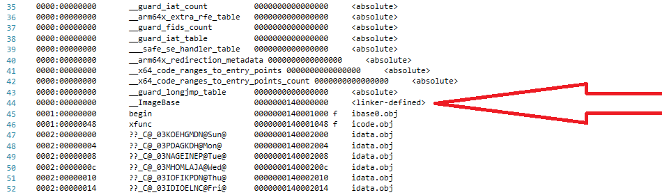

# GNU-ld-for-MicrosoftCOFF-To-LinuxELF

* [History](https://github.com/KilianKegel/GNU-ld-for-MicrosoftCOFF-to-LinuxELF#history)

# Introduction

While implementing support for LINUX x86_64 to the 
[**Torito C Library**](https://github.com/KilianKegel/torito-C-Library#torito-c-library) 
it turned out, that the **GNU** linker **ld** doesn't sufficiently understand the Microsoft COFF file format for .OBJ modules.

All .LIB and .OBJ modules created with the latest version of Visual Studio 2019 VS2019
are taken and processed by **GNU ld** (`GNU ld (GNU Binutils for Ubuntu) 2.34`) without any complaint, 
but the created .ELF image does not run at all, for many of the same reasons metioned below.

During my comprehensive exploration I found that
* placement of uninitialized data (global variables not explicitly set to 0) in .BSS section
  creates accesses to faulty addresses for data
* modules translated without the compiler switches `/Gw` and `/Gy`
    * `/Gw[-]` separate global variables for linker
    * `/Gy[-]` separate functions for linker
  creates accesses to faulty addresses for data and code
* modules translated with code optimization enabled creates accesses to faulty addresses for data


### Build Environment

* Windows 10 64
* VS2019 
* Windows Subystem Linux (WSL2) running a Ubuntu 20.04 image

The build platform was installed following this recipe:
https://github.com/KilianKegel/HowTo-setup-an-UEFI-Development-PC#howto-setup-an-uefi-development-pc
But only step (1), (2) and (16) are truly required.

### Build Target
Build target is .ELF x86_64 only.

To rebuild all the binaries, disassemblies and .OBJ file infos just invoke `m.bat` in each folder.
# Image-relative addressing bug

With optimization setting enabled (```/O1```, ```/O2```) the code generator
of the Microsoft C compiler *may use* the ```__ImageBase``` relative addressing method,
if special program characteristics were met.

## General description

In the **Optimization Manual** ([Optimizing subroutines in assembly language](https://www.agner.org/optimize/))
Agner Fog describes that Microsoft-specific addressing method: https://www.agner.org/optimize/optimizing_assembly.pdf#page=23

The Microsoft Linker LINK.EXE injects the symbol ```__ImageBase``` at link time if required.
In the sample below the RVA (relative virtual address) of 0x140000000 is assigned to ```__ImageBase```.



At program runtime ```__ImageBase``` points to the [`MZ-EXE-Header`](ldBugImageBase/PNG/ProcMemDumpWindows.txt).\
(NOTE: Due to [Address space layout randomization -- ASLR](https://en.wikipedia.org/wiki/Address_space_layout_randomization)
the runtime ```__ImageBase``` is relocated to a different address as assigned at link time.)

The references to image-relative addressed symbols 
that could be observed, use a ```[base + index*scale + disp]``` style indexed register-indirect addressing method descriped
here: https://www.amd.com/system/files/TechDocs/24592.pdf#page=50

The compiler uses the relocation type ```IMAGE_REL_AMD64_ADDR32NB```
([`The Common Language Infrastructure Annotated Standard`](https://books.google.de/books?id=50PhgS8vjhwC&pg=PA755&lpg=PA755&dq=REL32+ADDR32NB&source=bl&ots=v0Fv0kz3pR&sig=ACfU3U3WLFskN3kb94ktZ7ZnomEPHMf-pg&hl=en&sa=X&ved=2ahUKEwibycnIsd7uAhUDolwKHTslAaEQ6AEwB3oECAwQAg#v=onepage&q=REL32%20ADDR32NB&f=false),
http://www.m4b.io/goblin/goblin/pe/relocation/constant.IMAGE_REL_AMD64_ADDR32NB.html).
in the .OBJ module:


[complete listing](ldBugImageBase/BareCode4Windo.obj.dmp#L130)

The source code below implements the test scenario: [`main.c`](ldBugImageBase/main.c)

(The program copies into a predefined string "1234" at centerposition the string "AB". "AB" and its length
were accessed through arrays using indices. Doing so the Microsoft C compiler generates ```__ImageBase``` memory accesses.)

```c
/*
  compile with:
    cl / TC / DLINUXTARGET = 1 / DUSEPRINTF4OUTPUT = 0 / nologo / c / O1 / GS - / Ob0 / FoBareCode4Linux.obj / DBREAKORNOP = __debugbreak() main.c
    cl / TC / DLINUXTARGET = 0 / DUSEPRINTF4OUTPUT = 0 / nologo / c / O1 / GS - / Ob0 / FoBareCode4Windo.obj / DBREAKORNOP = __nop()        main.c
    cl / TC / DLINUXTARGET = 0 / DUSEPRINTF4OUTPUT = 1 / nologo / O1 / GS - / Ob0 / FoWinConsole.obj / DBREAKORNOP = __nop() main.c
*/
volatile int deadloopvar = 1;

void xfunc(const char c)
{
    //
    // GDB: info registers 
    // GDB: check register CL to hold the expected value
    //
    __debugbreak();
}

void xstring(char* str)
{
    int i = 0;

    while (str[i])
        xfunc(str[i++]);
}

int main(int argc, char** argv)
{
    unsigned long long tsc; // tsc is just inserted to get BREAKORNOP generated 0xCC/0x90 opcode
                            // sync in the .OBJ/binary

    if (1) {
    //
    // NOTE: this arrangement of source code is just to have similiar machine code for Windows and Linux
    //
        BREAKORNOP;                     // NOP or INT3 depending on /DBREAKORNOP=__debugbreak() or /DBREAKORNOP=__nop()
        while (1 == deadloopvar)        // deadloop for Windows debugging
            ;

        tsc = __rdtsc();
    }

    if (tsc/*TSC is never, never 0*/)
    {
#define STRING0 "AB"

        int i, j, x;
        static char buffer[5] = { "1234" };                 // pre-inialized array
        //
        // NOTE: when accessing static data "indexed", the compiler uses __ImageBase addressing scheme
        //       (with optimization enabled only)
        //
        static size_t   sizeTable[] = { sizeof(STRING0) };  // array that is accessed "indexed"
        static char* stringTable[] = { STRING0 };           // array that is accessed "indexed"

        for (j = 0; j < sizeof(sizeTable) / sizeof(sizeTable[0]); j++)
        {

            x = (int)(sizeof(buffer) - sizeTable[j]) / 2;
            i = 0;

            while (stringTable[j][i])
                buffer[x++] = stringTable[j][i++];
            //
            // print/write "1AB4"
            //

#if     0 == USEPRINTF4OUTPUT
            xstring(buffer);
#else// 0 == USEPRINTF4OUTPUT
            printf("%s\n", buffer);
#endif//0 == USEPRINTF4OUTPUT
        }
    }
#if     0 == USEPRINTF4OUTPUT
    xfunc(0xAA);    // signal end of second loop
#endif//0 == USEPRINTF4OUTPUT
    return 0;
}
```
[complete listing](ldBugImageBase/main.c)

Stepping through the program in the windows debuggger makes more clear, what the program is expected to
do on machine level -- and what's going wrong in Linux:
```
00007FF6576C1000  mov         qword ptr [rsp+8],rbx  
00007FF6576C1005  mov         qword ptr [rsp+10h],rbp  
00007FF6576C100A  mov         qword ptr [rsp+20h],rsi  
00007FF6576C100F  push        rdi  
00007FF6576C1010  sub         rsp,20h  

--> BREAKORNOP
00007FF6576C1014  nop

--> while (1 == deadloopvar);
00007FF6576C1015  mov         eax,dword ptr [7FF6576C3000h]
00007FF6576C101B  cmp         eax,1
00007FF6576C101E  je          00007FF6576C1015

-->  tsc = __rdtsc();
00007FF6576C1020  rdtsc

--> if (tsc/*TSC is never, never 0*/)
00007FF6576C1022  shl         rdx,20h
00007FF6576C1026  or          rax,rdx  
00007FF6576C1029  je          00007FF6576C1088  

00007FF6576C102B  xor         edi,edi  
    
--> load __ImageBase to EBP
00007FF6576C102D  lea         rbp,[7FF6576C0000h]

--> MZ-EXE header at Windows runtime
    0x00007FF6576C0000  4d 5a 90 00 03 00 00 00 04 00 00 00 ff ff 00 00  MZ..........ÿÿ..       
    0x00007FF6576C0010  b8 00 00 00 00 00 00 00 40 00 00 00 00 00 00 00  ¸.......@.......
    0x00007FF6576C0020  00 00 00 00 00 00 00 00 00 00 00 00 00 00 00 00  ................
    0x00007FF6576C0030  00 00 00 00 00 00 00 00 00 00 00 00 b8 00 00 00  ............¸...
    0x00007FF6576C0040  0e 1f ba 0e 00 b4 09 cd 21 b8 01 4c cd 21 54 68  ..º..´.Í!¸.LÍ!Th
    0x00007FF6576C0050  69 73 20 70 72 6f 67 72 61 6d 20 63 61 6e 6e 6f  is program canno
    0x00007FF6576C0060  74 20 62 65 20 72 75 6e 20 69 6e 20 44 4f 53 20  t be run in DOS 
    0x00007FF6576C0070  6d 6f 64 65 2e 0d 0d 0a 24 00 00 00 00 00 00 00  mode....$.......

00007FF6576C1034  xor         ebx,ebx  

--> load address of buffer
00007FF6576C1036  lea         rsi,[7FF6576C3004h]

    0x00007FF6576C3004  31 32 33 34 00 00 00 00 00 00 00 00 03 00 00 00  1234............
    0x00007FF6576C3014  00 00 00 00 00 20 6c 57 f6 7f 00 00 00 00 00 00  ..... lWö.......
    0x00007FF6576C3024  00 00 00 00 00 00 00 00 00 00 00 00 00 00 00 00  ................
    0x00007FF6576C3034  00 00 00 00 00 00 00 00 00 00 00 00 00 00 00 00  ................
    0x00007FF6576C3044  00 00 00 00 00 00 00 00 00 00 00 00 00 00 00 00  ................
    0x00007FF6576C3054  00 00 00 00 00 00 00 00 00 00 00 00 00 00 00 00  ................
    0x00007FF6576C3064  00 00 00 00 00 00 00 00 00 00 00 00 00 00 00 00  ................
    0x00007FF6576C3074  00 00 00 00 00 00 00 00 00 00 00 00 00 00 00 00  ................

--> load address of STRING0 in stringTable
00007FF6576C103D  mov         rcx,qword ptr [rbx+rbp+3018h]

    RCX 00007FF6576C2000	

    0x00007FF6576C2000  41 42 00 00 00 00 00 00 f4 63 23 60 00 00 00 00  AB......ôc#`....
    0x00007FF6576C2010  0d 00 00 00 70 00 00 00 20 20 00 00 20 06 00 00  ....p...  .. ...
    0x00007FF6576C2020  00 00 00 00 00 10 00 00 cf 00 00 00 2e 74 65 78  ........Ï....tex
    0x00007FF6576C2030  74 24 6d 6e 00 00 00 00 00 20 00 00 20 00 00 00  t$mn..... .. ...
    0x00007FF6576C2040  2e 72 64 61 74 61 00 00 20 20 00 00 70 00 00 00  .rdata..  ..p...
    0x00007FF6576C2050  2e 72 64 61 74 61 24 7a 7a 7a 64 62 67 00 00 00  .rdata$zzzdbg...
    0x00007FF6576C2060  90 20 00 00 1c 00 00 00 2e 78 64 61 74 61 00 00  . .......xdata..
    0x00007FF6576C2070  00 30 00 00 20 00 00 00 2e 64 61 74 61 00 00 00  .0.. ....data...

00007FF6576C1045  mov         r8b,byte ptr [rcx]  
00007FF6576C1048  test        r8b,r8b  
00007FF6576C104B  je          00007FF6576C1075  
00007FF6576C104D  mov         eax,5  

--> load sizeof(STRING0) from sizeTable
00007FF6576C1052  sub         eax,dword ptr [rbx+rbp+3010h]

    [rbx+rbp+3010h] 00007FF6576C3010
    0x00007FF6576C3010  03 00 00 00 00 00 00 00 00 20 6c 57 f6 7f 00 00  ......... lWö...
    0x00007FF6576C3020  00 00 00 00 00 00 00 00 00 00 00 00 00 00 00 00  ................
    0x00007FF6576C3030  00 00 00 00 00 00 00 00 00 00 00 00 00 00 00 00  ................
    0x00007FF6576C3040  00 00 00 00 00 00 00 00 00 00 00 00 00 00 00 00  ................
    0x00007FF6576C3050  00 00 00 00 00 00 00 00 00 00 00 00 00 00 00 00  ................
    0x00007FF6576C3060  00 00 00 00 00 00 00 00 00 00 00 00 00 00 00 00  ................
    0x00007FF6576C3070  00 00 00 00 00 00 00 00 00 00 00 00 00 00 00 00  ................

00007FF6576C1059  cdq  
00007FF6576C105A  sub         eax,edx  
00007FF6576C105C  sar         eax,1  
00007FF6576C105E  movsxd      rdx,eax  
00007FF6576C1061  add         rdx,rsi  
00007FF6576C1064  inc         rcx  

--> write "AB" to buffer "1234" @ "23"
00007FF6576C1067  mov         byte ptr [rdx],r8b

    0x00007FF6576C3004  31 41 33 34 00 00 00 00 00 00 00 00 03 00 00 00  1A34............ 
    0x00007FF6576C3014  00 00 00 00 00 20 6c 57 f6 7f 00 00 00 00 00 00  ..... lWö.......
    0x00007FF6576C3024  00 00 00 00 00 00 00 00 00 00 00 00 00 00 00 00  ................
    0x00007FF6576C3034  00 00 00 00 00 00 00 00 00 00 00 00 00 00 00 00  ................
    0x00007FF6576C3044  00 00 00 00 00 00 00 00 00 00 00 00 00 00 00 00  ................
    0x00007FF6576C3054  00 00 00 00 00 00 00 00 00 00 00 00 00 00 00 00  ................
    0x00007FF6576C3064  00 00 00 00 00 00 00 00 00 00 00 00 00 00 00 00  ................
    0x00007FF6576C3074  00 00 00 00 00 00 00 00 00 00 00 00 00 00 00 00  ................
  
        .
        .
        .

00007FF6576C10CE  ret
```
[complete listing](ldBugImageBase/PNG/TipoeThroughWindows.txt)
## Linking for Linux

As already said above, the Microsoft compiler and linker uses the symbol ```__ImageBase```
for the adressing scheme, that the linker artificially injects at link time.

The **GNU ld** needs ```__ImageBase``` to get  assigned as a command line parameter:
```
--defsym=__ImageBase=0x400000
```

0x400000 is the load address and is equal to ```__executable_start``` from
the default **GNU ld** link script https://github.com/KilianKegel/torito-LINK/blob/main/main.c#L1339.

### **Microsoft LINK.EXE** vs. **GNU ld**

**Microsoft LINK.EXE** initialized ```IMAGE_REL_AMD64_ADDR32NB``` relocations as those
were a *displacement* to ```__ImageStart```, while the base register is previously initialized
with ```__ImageStart```.
```
        .
        .
        .
    mov rcx,qword ptr [rbx+rbp+3018h]       ; RBP == __ImageBase, RBX == 0 -> index 0
        .                                   ; 0x3018 displacement of STRING0 in stringTable
        .
    sub eax,dword ptr [rbx+rbp+3010h]
        .
        .
        .
```
**GNU ld** initialized ```IMAGE_REL_AMD64_ADDR32NB``` relocations as those
were a *complete 32 bit address*. The base register (here ```RBP```) is assumed to be initialized previously to ZERO.
```
        .
        .
        .
    mov rcx,qword ptr [rbx+rbp+403068h]     ; RBP == 0, RBX == 0 -> index 0
        .                                   ; 0x403068 load address of STRING0 in stringTable in Linux
        .
    sub eax,dword ptr [rbx+rbp+403058h]
        .
        .
        .
```

[complete listing](ldBugImageBase/PNG/DiffELFEXE.htm)

<html><head>
<meta http-equiv="Content-Type" content="text/html; charset=windows-1252">
<style>
.AlignLeft { text-align: left; }
.AlignCenter { text-align: center; }
.AlignRight { text-align: right; }
body { font-family: sans-serif; font-size: 11pt; }
img.AutoScale { max-width: 100%; max-height: 100%; }
td { vertical-align: top; padding-left: 4px; padding-right: 4px; }

tr.SectionGap td { font-size: 4px; border-left: none; border-top: none; border-bottom: 1px solid Black; border-right: 1px solid Black; }
tr.SectionAll td { border-left: none; border-top: none; border-bottom: 1px solid Black; border-right: 1px solid Black; }
tr.SectionBegin td { border-left: none; border-top: none; border-right: 1px solid Black; }
tr.SectionEnd td { border-left: none; border-top: none; border-bottom: 1px solid Black; border-right: 1px solid Black; }
tr.SectionMiddle td { border-left: none; border-top: none; border-right: 1px solid Black; }
tr.SubsectionAll td { border-left: none; border-top: none; border-bottom: 1px solid Gray; border-right: 1px solid Black; }
tr.SubsectionEnd td { border-left: none; border-top: none; border-bottom: 1px solid Gray; border-right: 1px solid Black; }
table.fc { border-top: 1px solid Black; border-left: 1px solid Black; width: 100%; font-family: monospace; font-size: 10pt; }
td.TextItemInsigMod { color: #000000; background-color: #EEEEFF; }
td.TextItemInsigOrphan { color: #000000; background-color: #FAEEFF; }
td.TextItemNum { color: #696969; background-color: #F0F0F0; }
td.TextItemSame { color: #000000; background-color: #FFFFFF; }
td.TextItemSigMod { color: #000000; background-color: #FFECEC; }
td.TextItemSigOrphan { color: #000000; background-color: #F1E3FF; }
.TextSegInsigDiff { color: #0000FF; }
.TextSegReplacedDiff { color: #0000FF; font-style: italic; }
.TextSegSigDiff { color: #FF0000; }
td.TextItemInsigAdd { color: #000000; background-color: #EEEEFF; }
td.TextItemInsigDel { color: #000000; background-color: #EEEEFF; text-decoration: line-through; }
td.TextItemSigAdd { color: #000000; background-color: #FFECEC; }
td.TextItemSigDel { color: #000000; background-color: #FFECEC; text-decoration: line-through; }
</style>
<title>Text Compare</title>
</head>
<body>
Text Compare<br>
Produced: 2021-02-12 05:26:20 AM<br>
&nbsp; &nbsp;
<br>
Mode:&nbsp; All, Ignoring Unimportant &nbsp;
<br>
Left file: A:\GNU-ld-for-MicrosoftCOFF-to-LinuxELF2\ldBugImageBase\program_a.elf.dis &nbsp;
<br>
Right file: A:\GNU-ld-for-MicrosoftCOFF-to-LinuxELF2\ldBugImageBase\program_a.exe.dis &nbsp;
<br>
<table class="fc" cellspacing="0" cellpadding="0">
<tbody><tr class="SectionBegin">
<td class="TextItemSame">&nbsp;</td>
<td class="AlignCenter">-+</td>
<td class="TextItemSigMod"><span class="TextSegSigDiff">Microsoft</span> <span class="TextSegSigDiff">(R)</span> <span class="TextSegSigDiff">COFF/PE</span> <span class="TextSegSigDiff">Dumper</span> <span class="TextSegSigDiff">Version</span> <span class="TextSegSigDiff">14.28.29336.0</span></td>
</tr>
<tr class="SectionEnd">
<td class="TextItemSame">&nbsp;</td>
<td class="AlignCenter">&nbsp;</td>
<td class="TextItemSigMod"><span class="TextSegSigDiff">Copyright</span> <span class="TextSegSigDiff">(C)</span> <span class="TextSegSigDiff">Microsoft</span> <span class="TextSegSigDiff">Corporation.</span>&nbsp; <span class="TextSegSigDiff">All</span> <span class="TextSegSigDiff">rights</span> <span class="TextSegSigDiff">reserved.</span></td>
</tr>
<tr class="SectionBegin">
<td class="TextItemSame">&nbsp;</td>
<td class="AlignCenter">=</td>
<td class="TextItemSame">&nbsp;</td>
</tr>
<tr class="SectionEnd">
<td class="TextItemSame">&nbsp;</td>
<td class="AlignCenter">&nbsp;</td>
<td class="TextItemSame">&nbsp;</td>
</tr>
<tr class="SectionAll">
<td class="TextItemSigMod">p<span class="TextSegSigDiff">rogram.elf:</span>&nbsp; &nbsp;&nbsp; file <span class="TextSegSigDiff">f</span><span class="TextSegSigDiff">o</span><span class="TextSegSigDiff">r</span><span class="TextSegSigDiff">mat</span> e<span class="TextSegSigDiff">lf64-x86-64</span></td>
<td class="AlignCenter">&lt;&gt;</td>
<td class="TextItemSigMod"><span class="TextSegSigDiff">Dum</span>p <span class="TextSegSigDiff">o</span><span class="TextSegSigDiff">f</span> file <span class="TextSegSigDiff">program.</span>e<span class="TextSegSigDiff">xe</span></td>
</tr>
<tr class="SectionAll">
<td class="TextItemSame">&nbsp;</td>
<td class="AlignCenter">=</td>
<td class="TextItemSame">&nbsp;</td>
</tr>
<tr class="SectionBegin">
<td class="TextItemSigMod">&nbsp;</td>
<td class="AlignCenter">&lt;&gt;</td>
<td class="TextItemSigMod"><span class="TextSegSigDiff">File</span> <span class="TextSegSigDiff">Type:</span> <span class="TextSegSigDiff">EXECUTABLE</span> <span class="TextSegSigDiff">IMAGE</span></td>
</tr>
<tr class="SectionEnd">
<td class="TextItemSigMod"><span class="TextSegSigDiff">Disassembly</span> <span class="TextSegSigDiff">of</span> <span class="TextSegSigDiff">section</span> <span class="TextSegSigDiff">.text$mn:</span></td>
<td class="AlignCenter">&nbsp;</td>
<td class="TextItemSame">&nbsp;</td>
</tr>
<tr class="SectionAll">
<td class="TextItemSame">&nbsp;</td>
<td class="AlignCenter">=</td>
<td class="TextItemSame">&nbsp;</td>
</tr>
<tr class="SectionBegin">
<td class="TextItemSigMod"><span class="TextSegSigDiff">0000000000401000</span> <span class="TextSegSigDiff">&lt;main&gt;:</span></td>
<td class="AlignCenter">&lt;&gt;</td>
<td class="TextItemSame">&nbsp;</td>
</tr>
<tr class="SectionMiddle">
<td class="TextItemSigMod">&nbsp; <span class="TextSegSigDiff">4</span><span class="TextSegSigDiff">0</span>1000:&nbsp; &nbsp; &nbsp;&nbsp; 48 89 5c 24 08&nbsp; &nbsp; &nbsp; &nbsp; &nbsp; mov&nbsp; &nbsp; QWORD PTR [rsp+<span class="TextSegSigDiff">0x</span>8],rbx</td>
<td class="AlignCenter">&nbsp;</td>
<td class="TextItemSigMod">&nbsp; <span class="TextSegSigDiff">000000014000</span>1000: 48 89 5C 24 08&nbsp; &nbsp;&nbsp; mov&nbsp; &nbsp; &nbsp; &nbsp;&nbsp; qword ptr [rsp+8],rbx</td>
</tr>
<tr class="SectionMiddle">
<td class="TextItemSigMod">&nbsp; <span class="TextSegSigDiff">4</span><span class="TextSegSigDiff">0</span>1005:&nbsp; &nbsp; &nbsp;&nbsp; 48 89 6c 24 10&nbsp; &nbsp; &nbsp; &nbsp; &nbsp; mov&nbsp; &nbsp; QWORD PTR [rsp+<span class="TextSegSigDiff">0x</span>10],rbp</td>
<td class="AlignCenter">&nbsp;</td>
<td class="TextItemSigMod">&nbsp; <span class="TextSegSigDiff">000000014000</span>1005: 48 89 6C 24 10&nbsp; &nbsp;&nbsp; mov&nbsp; &nbsp; &nbsp; &nbsp;&nbsp; qword ptr [rsp+10<span class="TextSegSigDiff">h</span>],rbp</td>
</tr>
<tr class="SectionMiddle">
<td class="TextItemSigMod">&nbsp; <span class="TextSegSigDiff">4</span><span class="TextSegSigDiff">0</span>100a:&nbsp; &nbsp; &nbsp;&nbsp; 48 89 74 24 20&nbsp; &nbsp; &nbsp; &nbsp; &nbsp; mov&nbsp; &nbsp; QWORD PTR [rsp+<span class="TextSegSigDiff">0x</span>20],rsi</td>
<td class="AlignCenter">&nbsp;</td>
<td class="TextItemSigMod">&nbsp; <span class="TextSegSigDiff">000000014000</span>100A: 48 89 74 24 20&nbsp; &nbsp;&nbsp; mov&nbsp; &nbsp; &nbsp; &nbsp;&nbsp; qword ptr [rsp+20<span class="TextSegSigDiff">h</span>],rsi</td>
</tr>
<tr class="SectionMiddle">
<td class="TextItemSigMod">&nbsp; <span class="TextSegSigDiff">4</span>0100f:&nbsp;
 &nbsp; &nbsp;&nbsp; 57&nbsp; &nbsp; &nbsp; &nbsp; &nbsp; &nbsp; &nbsp; 
&nbsp; &nbsp; &nbsp; &nbsp; push&nbsp;&nbsp; rdi</td>
<td class="AlignCenter">&nbsp;</td>
<td class="TextItemSigMod">&nbsp; <span class="TextSegSigDiff">00000001400</span>0100F: 57&nbsp; &nbsp; &nbsp; &nbsp; &nbsp; &nbsp; &nbsp; &nbsp;&nbsp; push&nbsp; &nbsp; &nbsp; &nbsp; rdi</td>
</tr>
<tr class="SectionMiddle">
<td class="TextItemSigMod">&nbsp; <span class="TextSegSigDiff">4</span><span class="TextSegSigDiff">0</span>1010:&nbsp; &nbsp; &nbsp;&nbsp; 48 83 ec 20&nbsp; &nbsp; &nbsp; &nbsp; &nbsp; &nbsp;&nbsp; sub&nbsp; &nbsp; rsp,<span class="TextSegSigDiff">0x</span>20</td>
<td class="AlignCenter">&nbsp;</td>
<td class="TextItemSigMod">&nbsp; <span class="TextSegSigDiff">000000014000</span>1010: 48 83 EC 20&nbsp; &nbsp; &nbsp; &nbsp; sub&nbsp; &nbsp; &nbsp; &nbsp;&nbsp; rsp,20<span class="TextSegSigDiff">h</span></td>
</tr>
<tr class="SectionMiddle">
<td class="TextItemSigMod">&nbsp; <span class="TextSegSigDiff">4</span>01014:&nbsp; &nbsp; &nbsp;&nbsp; <span class="TextSegSigDiff">cc</span>&nbsp; &nbsp; &nbsp; &nbsp; &nbsp; &nbsp; &nbsp; &nbsp; &nbsp; &nbsp; &nbsp; <span class="TextSegSigDiff">int3</span>&nbsp; &nbsp;</td>
<td class="AlignCenter">&nbsp;</td>
<td class="TextItemSigMod">&nbsp; <span class="TextSegSigDiff">00000001400</span>01014: <span class="TextSegSigDiff">90</span>&nbsp; &nbsp; &nbsp; &nbsp; &nbsp; &nbsp; &nbsp; &nbsp;&nbsp; <span class="TextSegSigDiff">nop</span></td>
</tr>
<tr class="SectionMiddle">
<td class="TextItemSigMod">&nbsp; <span class="TextSegSigDiff">4</span>01015:&nbsp; &nbsp; &nbsp;&nbsp; 8b 05 1<span class="TextSegSigDiff">d</span> <span class="TextSegSigDiff">2</span>0 0<span class="TextSegSigDiff">0</span> 00&nbsp; &nbsp; &nbsp;&nbsp; mov&nbsp; &nbsp; eax,DWORD PTR [<span class="TextSegSigDiff">rip+</span><span class="TextSegSigDiff">0x2</span>01<span class="TextSegSigDiff">d]</span>&nbsp; &nbsp; &nbsp; &nbsp; <span class="TextSegSigDiff">#</span> 40<span class="TextSegSigDiff">3</span><span class="TextSegSigDiff">038</span> <span class="TextSegSigDiff">&lt;deadloopvar&gt;</span></td>
<td class="AlignCenter">&nbsp;</td>
<td class="TextItemSigMod">&nbsp; <span class="TextSegSigDiff">00000001400</span>01015: 8B 0<span class="TextSegSigDiff">5</span> <span class="TextSegSigDiff">E</span>5 1<span class="TextSegSigDiff">F</span> 00 00&nbsp; mov&nbsp; &nbsp; &nbsp; &nbsp;&nbsp; eax,dword ptr [<span class="TextSegSigDiff">000000</span>0140<span class="TextSegSigDiff">003000h]</span></td>
</tr>
<tr class="SectionMiddle">
<td class="TextItemSigMod">&nbsp; <span class="TextSegSigDiff">4</span><span class="TextSegSigDiff">0</span>101b:&nbsp; &nbsp; &nbsp;&nbsp; 83 f8 01&nbsp; &nbsp; &nbsp; &nbsp; &nbsp; &nbsp; &nbsp; &nbsp; cmp&nbsp; &nbsp; eax,<span class="TextSegSigDiff">0x</span>1</td>
<td class="AlignCenter">&nbsp;</td>
<td class="TextItemSigMod">&nbsp; <span class="TextSegSigDiff">000000014000</span>101B: 83 F8 01&nbsp; &nbsp; &nbsp; &nbsp; &nbsp;&nbsp; cmp&nbsp; &nbsp; &nbsp; &nbsp;&nbsp; eax,1</td>
</tr>
<tr class="SectionMiddle">
<td class="TextItemSigMod">&nbsp; <span class="TextSegSigDiff">4</span>0101e:&nbsp; &nbsp; &nbsp;&nbsp; 74 f5&nbsp; &nbsp; &nbsp; &nbsp; &nbsp; &nbsp; &nbsp; &nbsp; &nbsp;&nbsp; <span class="TextSegSigDiff">je</span>&nbsp; &nbsp;&nbsp; 40<span class="TextSegSigDiff">1</span>01<span class="TextSegSigDiff">5</span> <span class="TextSegSigDiff">&lt;main+0x</span>15<span class="TextSegSigDiff">&gt;</span></td>
<td class="AlignCenter">&nbsp;</td>
<td class="TextItemSigMod">&nbsp; <span class="TextSegSigDiff">00000001400</span>0101E: 74 F5&nbsp; &nbsp; &nbsp; &nbsp; &nbsp; &nbsp; &nbsp; <span class="TextSegSigDiff">je</span>&nbsp; &nbsp; &nbsp; &nbsp; &nbsp; <span class="TextSegSigDiff">00000001</span>40<span class="TextSegSigDiff">0</span>01<span class="TextSegSigDiff">0</span>15</td>
</tr>
<tr class="SectionMiddle">
<td class="TextItemSigMod">&nbsp; <span class="TextSegSigDiff">4</span><span class="TextSegSigDiff">0</span>1020:&nbsp; &nbsp; &nbsp;&nbsp; 0f 31&nbsp; &nbsp; &nbsp; &nbsp; &nbsp; &nbsp; &nbsp; &nbsp; &nbsp;&nbsp; rdtsc &nbsp;</td>
<td class="AlignCenter">&nbsp;</td>
<td class="TextItemSigMod">&nbsp; <span class="TextSegSigDiff">000000014000</span>1020: 0F 31&nbsp; &nbsp; &nbsp; &nbsp; &nbsp; &nbsp; &nbsp; rdtsc</td>
</tr>
<tr class="SectionMiddle">
<td class="TextItemSigMod">&nbsp; <span class="TextSegSigDiff">4</span><span class="TextSegSigDiff">0</span>1022:&nbsp; &nbsp; &nbsp;&nbsp; 48 c1 e2 20&nbsp; &nbsp; &nbsp; &nbsp; &nbsp; &nbsp;&nbsp; shl&nbsp; &nbsp; rdx,<span class="TextSegSigDiff">0x</span>20</td>
<td class="AlignCenter">&nbsp;</td>
<td class="TextItemSigMod">&nbsp; <span class="TextSegSigDiff">000000014000</span>1022: 48 C1 E2 20&nbsp; &nbsp; &nbsp; &nbsp; shl&nbsp; &nbsp; &nbsp; &nbsp;&nbsp; rdx,20<span class="TextSegSigDiff">h</span></td>
</tr>
<tr class="SectionMiddle">
<td class="TextItemSigMod">&nbsp; <span class="TextSegSigDiff">4</span>01026:&nbsp; &nbsp; &nbsp;&nbsp; 48 0b c2&nbsp; &nbsp; &nbsp; &nbsp; &nbsp; &nbsp; &nbsp; &nbsp; <span class="TextSegSigDiff">or</span>&nbsp; &nbsp;&nbsp; rax,rdx</td>
<td class="AlignCenter">&nbsp;</td>
<td class="TextItemSigMod">&nbsp; <span class="TextSegSigDiff">00000001400</span>01026: 48 0B C2&nbsp; &nbsp; &nbsp; &nbsp; &nbsp;&nbsp; <span class="TextSegSigDiff">or</span>&nbsp; &nbsp; &nbsp; &nbsp; &nbsp; rax,rdx</td>
</tr>
<tr class="SectionMiddle">
<td class="TextItemSigMod">&nbsp; <span class="TextSegSigDiff">4</span><span class="TextSegSigDiff">0</span>1029:&nbsp; &nbsp; &nbsp;&nbsp; 74 5d&nbsp; &nbsp; &nbsp; &nbsp; &nbsp; &nbsp; &nbsp; &nbsp; &nbsp;&nbsp; <span class="TextSegSigDiff">je</span>&nbsp; &nbsp;&nbsp; <span class="TextSegSigDiff">4</span>01088 <span class="TextSegSigDiff">&lt;main+0x88&gt;</span></td>
<td class="AlignCenter">&nbsp;</td>
<td class="TextItemSigMod">&nbsp; <span class="TextSegSigDiff">000000014000</span>1029: 74 5D&nbsp; &nbsp; &nbsp; &nbsp; &nbsp; &nbsp; &nbsp; <span class="TextSegSigDiff">je</span>&nbsp; &nbsp; &nbsp; &nbsp; &nbsp; <span class="TextSegSigDiff">00000001400</span>01088</td>
</tr>
<tr class="SectionMiddle">
<td class="TextItemSigMod">&nbsp; <span class="TextSegSigDiff">4</span>0102b:&nbsp;
 &nbsp; &nbsp;&nbsp; 33 ff&nbsp; &nbsp; &nbsp; &nbsp; &nbsp; &nbsp; 
&nbsp; &nbsp; &nbsp;&nbsp; xor&nbsp; &nbsp; edi,edi</td>
<td class="AlignCenter">&nbsp;</td>
<td class="TextItemSigMod">&nbsp; <span class="TextSegSigDiff">00000001400</span>0102B: 33 FF&nbsp; &nbsp; &nbsp; &nbsp; &nbsp; &nbsp; &nbsp; xor&nbsp; &nbsp; &nbsp; &nbsp;&nbsp; edi,edi</td>
</tr>
<tr class="SectionMiddle">
<td class="TextItemSigMod">&nbsp; <span class="TextSegSigDiff">4</span>0102d:&nbsp; &nbsp; &nbsp;&nbsp; 48 8d 2d cc ef ff <span class="TextSegSigDiff">ff</span>&nbsp; &nbsp; lea&nbsp; &nbsp; rbp,[<span class="TextSegSigDiff">rip+</span><span class="TextSegSigDiff">0xffffffffffffefcc]</span>&nbsp; &nbsp; &nbsp; &nbsp; <span class="TextSegSigDiff">#</span> <span class="TextSegSigDiff">4</span>00000 <span class="TextSegSigDiff">&lt;__ImageBase&gt;</span></td>
<td class="AlignCenter">&nbsp;</td>
<td class="TextItemSigMod">&nbsp; <span class="TextSegSigDiff">00000001400</span>0102D: 48 8D 2D CC EF FF&nbsp; lea&nbsp; &nbsp; &nbsp; &nbsp;&nbsp; rbp,[<span class="TextSegSigDiff">00000001</span><span class="TextSegSigDiff">400</span>00000<span class="TextSegSigDiff">h]</span></td>
</tr>
<tr class="SectionMiddle">
<td class="TextItemSame">&nbsp;</td>
<td class="AlignCenter">&nbsp;</td>
<td class="TextItemSigMod">&nbsp;&nbsp; &nbsp; &nbsp; &nbsp; &nbsp; &nbsp; &nbsp; &nbsp; &nbsp;&nbsp; <span class="TextSegSigDiff">FF</span></td>
</tr>
<tr class="SectionMiddle">
<td class="TextItemSigMod">&nbsp; <span class="TextSegSigDiff">4</span>01034:&nbsp;
 &nbsp; &nbsp;&nbsp; 33 db&nbsp; &nbsp; &nbsp; &nbsp; &nbsp; &nbsp; 
&nbsp; &nbsp; &nbsp;&nbsp; xor&nbsp; &nbsp; ebx,ebx</td>
<td class="AlignCenter">&nbsp;</td>
<td class="TextItemSigMod">&nbsp; <span class="TextSegSigDiff">00000001400</span>01034: 33 DB&nbsp; &nbsp; &nbsp; &nbsp; &nbsp; &nbsp; &nbsp; xor&nbsp; &nbsp; &nbsp; &nbsp;&nbsp; ebx,ebx</td>
</tr>
<tr class="SectionMiddle">
<td class="TextItemSigMod">&nbsp; <span class="TextSegSigDiff">4</span><span class="TextSegSigDiff">0</span>1036:&nbsp; &nbsp; &nbsp;&nbsp; 48 8d 35 <span class="TextSegSigDiff">ff</span> 1f 00 <span class="TextSegSigDiff">00</span>&nbsp; &nbsp; lea&nbsp; &nbsp; rsi,[<span class="TextSegSigDiff">rip+</span><span class="TextSegSigDiff">0x1fff]</span>&nbsp; &nbsp; &nbsp; &nbsp; <span class="TextSegSigDiff">#</span> <span class="TextSegSigDiff">4</span><span class="TextSegSigDiff">0</span>30<span class="TextSegSigDiff">3c</span> <span class="TextSegSigDiff">&lt;deadloopvar+0x4&gt;</span></td>
<td class="AlignCenter">&nbsp;</td>
<td class="TextItemSigMod">&nbsp; <span class="TextSegSigDiff">000000014000</span>1036: 48 8D 35 <span class="TextSegSigDiff">C7</span> 1F 00&nbsp; lea&nbsp; &nbsp; &nbsp; &nbsp;&nbsp; rsi,[<span class="TextSegSigDiff">0000000</span><span class="TextSegSigDiff">1</span><span class="TextSegSigDiff">4000</span>30<span class="TextSegSigDiff">0</span><span class="TextSegSigDiff">4h]</span></td>
</tr>
<tr class="SectionMiddle">
<td class="TextItemSame">&nbsp;</td>
<td class="AlignCenter">&nbsp;</td>
<td class="TextItemSigMod">&nbsp;&nbsp; &nbsp; &nbsp; &nbsp; &nbsp; &nbsp; &nbsp; &nbsp; &nbsp;&nbsp; <span class="TextSegSigDiff">00</span></td>
</tr>
<tr class="SectionMiddle">
<td class="TextItemSigMod">&nbsp; <span class="TextSegSigDiff">4</span>0103d:&nbsp; &nbsp; &nbsp;&nbsp; 48 8b 8c 2b <span class="TextSegSigDiff">6</span>8 30 <span class="TextSegSigDiff">40</span>&nbsp; &nbsp; mov&nbsp; &nbsp; rcx,QWORD PTR [rbx+rbp<span class="TextSegSigDiff">*1</span>+<span class="TextSegSigDiff">0x4</span>030<span class="TextSegSigDiff">68</span>]</td>
<td class="AlignCenter">&nbsp;</td>
<td class="TextItemSigMod">&nbsp; <span class="TextSegSigDiff">00000001400</span>0103D: 48 8B 8C 2B <span class="TextSegSigDiff">1</span>8 30&nbsp; mov&nbsp; &nbsp; &nbsp; &nbsp;&nbsp; rcx,qword ptr [rbx+rbp+<span class="TextSegSigDiff">00000000000</span>030<span class="TextSegSigDiff">18h</span>]</td>
</tr>
<tr class="SectionMiddle">
<td class="TextItemSigMod">&nbsp; <span class="TextSegSigDiff">4</span><span class="TextSegSigDiff">01044:</span>&nbsp; &nbsp; &nbsp;&nbsp; 00&nbsp;</td>
<td class="AlignCenter">&nbsp;</td>
<td class="TextItemSigMod">&nbsp;&nbsp; &nbsp; &nbsp; &nbsp; &nbsp; &nbsp; &nbsp; &nbsp; &nbsp;&nbsp; <span class="TextSegSigDiff">0</span><span class="TextSegSigDiff">0</span> 00</td>
</tr>
<tr class="SectionMiddle">
<td class="TextItemSigMod">&nbsp; <span class="TextSegSigDiff">4</span>01045:&nbsp;
 &nbsp; &nbsp;&nbsp; 44 8a 01&nbsp; &nbsp; &nbsp; &nbsp; &nbsp; &nbsp; 
&nbsp; &nbsp; mov&nbsp; &nbsp; r8b,BYTE PTR [rcx]</td>
<td class="AlignCenter">&nbsp;</td>
<td class="TextItemSigMod">&nbsp; <span class="TextSegSigDiff">00000001400</span>01045: 44 8A 01&nbsp; &nbsp; &nbsp; &nbsp; &nbsp;&nbsp; mov&nbsp; &nbsp; &nbsp; &nbsp;&nbsp; r8b,byte ptr [rcx]</td>
</tr>
<tr class="SectionMiddle">
<td class="TextItemSigMod">&nbsp; <span class="TextSegSigDiff">4</span>01048:&nbsp; &nbsp; &nbsp;&nbsp; 45 84 c0&nbsp; &nbsp; &nbsp; &nbsp; &nbsp; &nbsp; &nbsp; &nbsp; test&nbsp;&nbsp; r8b,r8b</td>
<td class="AlignCenter">&nbsp;</td>
<td class="TextItemSigMod">&nbsp; <span class="TextSegSigDiff">00000001400</span>01048: 45 84 C0&nbsp; &nbsp; &nbsp; &nbsp; &nbsp;&nbsp; test&nbsp; &nbsp; &nbsp; &nbsp; r8b,r8b</td>
</tr>
<tr class="SectionMiddle">
<td class="TextItemSigMod">&nbsp; <span class="TextSegSigDiff">4</span><span class="TextSegSigDiff">0</span>104b:&nbsp; &nbsp; &nbsp;&nbsp; 74 28&nbsp; &nbsp; &nbsp; &nbsp; &nbsp; &nbsp; &nbsp; &nbsp; &nbsp;&nbsp; <span class="TextSegSigDiff">je</span>&nbsp; &nbsp;&nbsp; <span class="TextSegSigDiff">4</span>01075 <span class="TextSegSigDiff">&lt;main+0x75&gt;</span></td>
<td class="AlignCenter">&nbsp;</td>
<td class="TextItemSigMod">&nbsp; <span class="TextSegSigDiff">000000014000</span>104B: 74 28&nbsp; &nbsp; &nbsp; &nbsp; &nbsp; &nbsp; &nbsp; <span class="TextSegSigDiff">je</span>&nbsp; &nbsp; &nbsp; &nbsp; &nbsp; <span class="TextSegSigDiff">00000001400</span>01075</td>
</tr>
<tr class="SectionMiddle">
<td class="TextItemSigMod">&nbsp; <span class="TextSegSigDiff">4</span><span class="TextSegSigDiff">0</span>104d:&nbsp; &nbsp; &nbsp;&nbsp; b8 05 00 00 00&nbsp; &nbsp; &nbsp; &nbsp; &nbsp; mov&nbsp; &nbsp; eax,<span class="TextSegSigDiff">0x</span>5</td>
<td class="AlignCenter">&nbsp;</td>
<td class="TextItemSigMod">&nbsp; <span class="TextSegSigDiff">000000014000</span>104D: B8 05 00 00 00&nbsp; &nbsp;&nbsp; mov&nbsp; &nbsp; &nbsp; &nbsp;&nbsp; eax,5</td>
</tr>
<tr class="SectionMiddle">
<td class="TextItemSigMod">&nbsp; <span class="TextSegSigDiff">4</span><span class="TextSegSigDiff">0</span>1052:&nbsp; &nbsp; &nbsp;&nbsp; 2b 84 2b <span class="TextSegSigDiff">58</span> 30 <span class="TextSegSigDiff">4</span>0 <span class="TextSegSigDiff">00</span>&nbsp; &nbsp; sub&nbsp; &nbsp; eax,DWORD PTR [rbx+rbp<span class="TextSegSigDiff">*1</span>+<span class="TextSegSigDiff">0x4</span>030<span class="TextSegSigDiff">58</span>]</td>
<td class="AlignCenter">&nbsp;</td>
<td class="TextItemSigMod">&nbsp; <span class="TextSegSigDiff">000000014000</span>1052: 2B 84 2B <span class="TextSegSigDiff">10</span> 30 <span class="TextSegSigDiff">0</span>0&nbsp; sub&nbsp; &nbsp; &nbsp; &nbsp;&nbsp; eax,dword ptr [rbx+rbp+<span class="TextSegSigDiff">00000000000</span>030<span class="TextSegSigDiff">10h</span>]</td>
</tr>
<tr class="SectionMiddle">
<td class="TextItemSame">&nbsp;</td>
<td class="AlignCenter">&nbsp;</td>
<td class="TextItemSigMod">&nbsp;&nbsp; &nbsp; &nbsp; &nbsp; &nbsp; &nbsp; &nbsp; &nbsp; &nbsp;&nbsp; <span class="TextSegSigDiff">00</span></td>
</tr>
<tr class="SectionMiddle">
<td class="TextItemSigMod">&nbsp; <span class="TextSegSigDiff">4</span>01059:&nbsp;
 &nbsp; &nbsp;&nbsp; 99&nbsp; &nbsp; &nbsp; &nbsp; &nbsp; &nbsp; &nbsp; 
&nbsp; &nbsp; &nbsp; &nbsp; cdq&nbsp;&nbsp; &nbsp;</td>
<td class="AlignCenter">&nbsp;</td>
<td class="TextItemSigMod">&nbsp; <span class="TextSegSigDiff">00000001400</span>01059: 99&nbsp; &nbsp; &nbsp; &nbsp; &nbsp; &nbsp; &nbsp; &nbsp;&nbsp; cdq</td>
</tr>
<tr class="SectionMiddle">
<td class="TextItemSigMod">&nbsp; <span class="TextSegSigDiff">4</span>0105a:&nbsp;
 &nbsp; &nbsp;&nbsp; 2b c2&nbsp; &nbsp; &nbsp; &nbsp; &nbsp; &nbsp; 
&nbsp; &nbsp; &nbsp;&nbsp; sub&nbsp; &nbsp; eax,edx</td>
<td class="AlignCenter">&nbsp;</td>
<td class="TextItemSigMod">&nbsp; <span class="TextSegSigDiff">00000001400</span>0105A: 2B C2&nbsp; &nbsp; &nbsp; &nbsp; &nbsp; &nbsp; &nbsp; sub&nbsp; &nbsp; &nbsp; &nbsp;&nbsp; eax,edx</td>
</tr>
<tr class="SectionMiddle">
<td class="TextItemSigMod">&nbsp; <span class="TextSegSigDiff">4</span>0105c:&nbsp;
 &nbsp; &nbsp;&nbsp; d1 f8&nbsp; &nbsp; &nbsp; &nbsp; &nbsp; &nbsp; 
&nbsp; &nbsp; &nbsp;&nbsp; sar&nbsp; &nbsp; eax,1</td>
<td class="AlignCenter">&nbsp;</td>
<td class="TextItemSigMod">&nbsp; <span class="TextSegSigDiff">00000001400</span>0105C: D1 F8&nbsp; &nbsp; &nbsp; &nbsp; &nbsp; &nbsp; &nbsp; sar&nbsp; &nbsp; &nbsp; &nbsp;&nbsp; eax,1</td>
</tr>
<tr class="SectionMiddle">
<td class="TextItemSigMod">&nbsp; <span class="TextSegSigDiff">4</span>0105e:&nbsp; &nbsp; &nbsp;&nbsp; 48 63 d0&nbsp; &nbsp; &nbsp; &nbsp; &nbsp; &nbsp; &nbsp; &nbsp; movsxd rdx,eax</td>
<td class="AlignCenter">&nbsp;</td>
<td class="TextItemSigMod">&nbsp; <span class="TextSegSigDiff">00000001400</span>0105E: 48 63 D0&nbsp; &nbsp; &nbsp; &nbsp; &nbsp;&nbsp; movsxd&nbsp; &nbsp; &nbsp; rdx,eax</td>
</tr>
<tr class="SectionMiddle">
<td class="TextItemSigMod">&nbsp; <span class="TextSegSigDiff">4</span>01061:&nbsp; &nbsp; &nbsp;&nbsp; 48 03 d6&nbsp; &nbsp; &nbsp; &nbsp; &nbsp; &nbsp; &nbsp; &nbsp; add&nbsp; &nbsp; rdx,rsi</td>
<td class="AlignCenter">&nbsp;</td>
<td class="TextItemSigMod">&nbsp; <span class="TextSegSigDiff">00000001400</span>01061: 48 03 D6&nbsp; &nbsp; &nbsp; &nbsp; &nbsp;&nbsp; add&nbsp; &nbsp; &nbsp; &nbsp;&nbsp; rdx,rsi</td>
</tr>
<tr class="SectionMiddle">
<td class="TextItemSigMod">&nbsp; <span class="TextSegSigDiff">4</span>01064:&nbsp; &nbsp; &nbsp;&nbsp; 48 ff c1&nbsp; &nbsp; &nbsp; &nbsp; &nbsp; &nbsp; &nbsp; &nbsp; inc&nbsp; &nbsp; rcx</td>
<td class="AlignCenter">&nbsp;</td>
<td class="TextItemSigMod">&nbsp; <span class="TextSegSigDiff">00000001400</span>01064: 48 FF C1&nbsp; &nbsp; &nbsp; &nbsp; &nbsp;&nbsp; inc&nbsp; &nbsp; &nbsp; &nbsp;&nbsp; rcx</td>
</tr>
<tr class="SectionMiddle">
<td class="TextItemSigMod">&nbsp; <span class="TextSegSigDiff">4</span>01067:&nbsp;
 &nbsp; &nbsp;&nbsp; 44 88 02&nbsp; &nbsp; &nbsp; &nbsp; &nbsp; &nbsp; 
&nbsp; &nbsp; mov&nbsp; &nbsp; BYTE PTR [rdx],r8b</td>
<td class="AlignCenter">&nbsp;</td>
<td class="TextItemSigMod">&nbsp; <span class="TextSegSigDiff">00000001400</span>01067: 44 88 02&nbsp; &nbsp; &nbsp; &nbsp; &nbsp;&nbsp; mov&nbsp; &nbsp; &nbsp; &nbsp;&nbsp; byte ptr [rdx],r8b</td>
</tr>
<tr class="SectionMiddle">
<td class="TextItemSigMod">&nbsp; <span class="TextSegSigDiff">4</span>0106a:&nbsp; &nbsp; &nbsp;&nbsp; 48 ff c2&nbsp; &nbsp; &nbsp; &nbsp; &nbsp; &nbsp; &nbsp; &nbsp; inc&nbsp; &nbsp; rdx</td>
<td class="AlignCenter">&nbsp;</td>
<td class="TextItemSigMod">&nbsp; <span class="TextSegSigDiff">00000001400</span>0106A: 48 FF C2&nbsp; &nbsp; &nbsp; &nbsp; &nbsp;&nbsp; inc&nbsp; &nbsp; &nbsp; &nbsp;&nbsp; rdx</td>
</tr>
<tr class="SectionMiddle">
<td class="TextItemSigMod">&nbsp; <span class="TextSegSigDiff">4</span>0106d:&nbsp;
 &nbsp; &nbsp;&nbsp; 44 8a 01&nbsp; &nbsp; &nbsp; &nbsp; &nbsp; &nbsp; 
&nbsp; &nbsp; mov&nbsp; &nbsp; r8b,BYTE PTR [rcx]</td>
<td class="AlignCenter">&nbsp;</td>
<td class="TextItemSigMod">&nbsp; <span class="TextSegSigDiff">00000001400</span>0106D: 44 8A 01&nbsp; &nbsp; &nbsp; &nbsp; &nbsp;&nbsp; mov&nbsp; &nbsp; &nbsp; &nbsp;&nbsp; r8b,byte ptr [rcx]</td>
</tr>
<tr class="SectionMiddle">
<td class="TextItemSigMod">&nbsp; <span class="TextSegSigDiff">4</span>01070:&nbsp; &nbsp; &nbsp;&nbsp; 45 84 c0&nbsp; &nbsp; &nbsp; &nbsp; &nbsp; &nbsp; &nbsp; &nbsp; test&nbsp;&nbsp; r8b,r8b</td>
<td class="AlignCenter">&nbsp;</td>
<td class="TextItemSigMod">&nbsp; <span class="TextSegSigDiff">00000001400</span>01070: 45 84 C0&nbsp; &nbsp; &nbsp; &nbsp; &nbsp;&nbsp; test&nbsp; &nbsp; &nbsp; &nbsp; r8b,r8b</td>
</tr>
<tr class="SectionMiddle">
<td class="TextItemSigMod">&nbsp; <span class="TextSegSigDiff">4</span><span class="TextSegSigDiff">0</span>1073:&nbsp; &nbsp; &nbsp;&nbsp; 75 ef&nbsp; &nbsp; &nbsp; &nbsp; &nbsp; &nbsp; &nbsp; &nbsp; &nbsp;&nbsp; jne&nbsp; &nbsp; <span class="TextSegSigDiff">4</span>01064 <span class="TextSegSigDiff">&lt;main+0x64&gt;</span></td>
<td class="AlignCenter">&nbsp;</td>
<td class="TextItemSigMod">&nbsp; <span class="TextSegSigDiff">000000014000</span>1073: 75 EF&nbsp; &nbsp; &nbsp; &nbsp; &nbsp; &nbsp; &nbsp; jne&nbsp; &nbsp; &nbsp; &nbsp;&nbsp; <span class="TextSegSigDiff">00000001400</span>01064</td>
</tr>
<tr class="SectionMiddle">
<td class="TextItemSigMod">&nbsp; <span class="TextSegSigDiff">4</span>01075:&nbsp; &nbsp; &nbsp;&nbsp; 48 8b ce&nbsp; &nbsp; &nbsp; &nbsp; &nbsp; &nbsp; &nbsp; &nbsp; mov&nbsp; &nbsp; rcx,rsi</td>
<td class="AlignCenter">&nbsp;</td>
<td class="TextItemSigMod">&nbsp; <span class="TextSegSigDiff">00000001400</span>01075: 48 8B CE&nbsp; &nbsp; &nbsp; &nbsp; &nbsp;&nbsp; mov&nbsp; &nbsp; &nbsp; &nbsp;&nbsp; rcx,rsi</td>
</tr>
<tr class="SectionMiddle">
<td class="TextItemSigMod">&nbsp; <span class="TextSegSigDiff">4</span>01078:&nbsp; &nbsp; &nbsp;&nbsp; e8 2f 00 00 00&nbsp; &nbsp; &nbsp; &nbsp; &nbsp; call&nbsp;&nbsp; <span class="TextSegSigDiff">4</span>010ac <span class="TextSegSigDiff">&lt;xstring&gt;</span></td>
<td class="AlignCenter">&nbsp;</td>
<td class="TextItemSigMod">&nbsp; <span class="TextSegSigDiff">00000001400</span>01078: E8 2F 00 00 00&nbsp; &nbsp;&nbsp; call&nbsp; &nbsp; &nbsp; &nbsp; <span class="TextSegSigDiff">00000001400</span>010AC</td>
</tr>
<tr class="SectionMiddle">
<td class="TextItemSigMod">&nbsp; <span class="TextSegSigDiff">4</span>0107d:&nbsp; &nbsp; &nbsp;&nbsp; ff c7&nbsp; &nbsp; &nbsp; &nbsp; &nbsp; &nbsp; &nbsp; &nbsp; &nbsp;&nbsp; inc&nbsp; &nbsp; edi</td>
<td class="AlignCenter">&nbsp;</td>
<td class="TextItemSigMod">&nbsp; <span class="TextSegSigDiff">00000001400</span>0107D: FF C7&nbsp; &nbsp; &nbsp; &nbsp; &nbsp; &nbsp; &nbsp; inc&nbsp; &nbsp; &nbsp; &nbsp;&nbsp; edi</td>
</tr>
<tr class="SectionMiddle">
<td class="TextItemSigMod">&nbsp; <span class="TextSegSigDiff">4</span><span class="TextSegSigDiff">0</span>107f:&nbsp; &nbsp; &nbsp;&nbsp; 48 83 c3 08&nbsp; &nbsp; &nbsp; &nbsp; &nbsp; &nbsp;&nbsp; add&nbsp; &nbsp; rbx,<span class="TextSegSigDiff">0x</span>8</td>
<td class="AlignCenter">&nbsp;</td>
<td class="TextItemSigMod">&nbsp; <span class="TextSegSigDiff">000000014000</span>107F: 48 83 C3 08&nbsp; &nbsp; &nbsp; &nbsp; add&nbsp; &nbsp; &nbsp; &nbsp;&nbsp; rbx,8</td>
</tr>
<tr class="SectionMiddle">
<td class="TextItemSigMod">&nbsp; <span class="TextSegSigDiff">4</span><span class="TextSegSigDiff">0</span>1083:&nbsp; &nbsp; &nbsp;&nbsp; 83 ff 01&nbsp; &nbsp; &nbsp; &nbsp; &nbsp; &nbsp; &nbsp; &nbsp; cmp&nbsp; &nbsp; edi,<span class="TextSegSigDiff">0x</span>1</td>
<td class="AlignCenter">&nbsp;</td>
<td class="TextItemSigMod">&nbsp; <span class="TextSegSigDiff">000000014000</span>1083: 83 FF 01&nbsp; &nbsp; &nbsp; &nbsp; &nbsp;&nbsp; cmp&nbsp; &nbsp; &nbsp; &nbsp;&nbsp; edi,1</td>
</tr>
<tr class="SectionMiddle">
<td class="TextItemSigMod">&nbsp; <span class="TextSegSigDiff">4</span><span class="TextSegSigDiff">0</span>1086:&nbsp; &nbsp; &nbsp;&nbsp; 72 b5&nbsp; &nbsp; &nbsp; &nbsp; &nbsp; &nbsp; &nbsp; &nbsp; &nbsp;&nbsp; <span class="TextSegSigDiff">jb</span>&nbsp; &nbsp;&nbsp; <span class="TextSegSigDiff">4</span>0103d <span class="TextSegSigDiff">&lt;main+0x3d&gt;</span></td>
<td class="AlignCenter">&nbsp;</td>
<td class="TextItemSigMod">&nbsp; <span class="TextSegSigDiff">000000014000</span>1086: 72 B5&nbsp; &nbsp; &nbsp; &nbsp; &nbsp; &nbsp; &nbsp; <span class="TextSegSigDiff">jb</span>&nbsp; &nbsp; &nbsp; &nbsp; &nbsp; <span class="TextSegSigDiff">00000001400</span>0103D</td>
</tr>
<tr class="SectionMiddle">
<td class="TextItemSigMod">&nbsp; <span class="TextSegSigDiff">4</span><span class="TextSegSigDiff">0</span>1088:&nbsp; &nbsp; &nbsp;&nbsp; b1 aa&nbsp; &nbsp; &nbsp; &nbsp; &nbsp; &nbsp; &nbsp; &nbsp; &nbsp;&nbsp; mov&nbsp; &nbsp; cl,0<span class="TextSegSigDiff">x</span>aa</td>
<td class="AlignCenter">&nbsp;</td>
<td class="TextItemSigMod">&nbsp; <span class="TextSegSigDiff">000000014000</span>1088: B1 AA&nbsp; &nbsp; &nbsp; &nbsp; &nbsp; &nbsp; &nbsp; mov&nbsp; &nbsp; &nbsp; &nbsp;&nbsp; cl,0AA<span class="TextSegSigDiff">h</span></td>
</tr>
<tr class="SectionMiddle">
<td class="TextItemSigMod">&nbsp; <span class="TextSegSigDiff">4</span>0108a:&nbsp; &nbsp; &nbsp;&nbsp; e8 19 00 00 00&nbsp; &nbsp; &nbsp; &nbsp; &nbsp; call&nbsp;&nbsp; <span class="TextSegSigDiff">4</span><span class="TextSegSigDiff">0</span>10a8 <span class="TextSegSigDiff">&lt;xfunc&gt;</span></td>
<td class="AlignCenter">&nbsp;</td>
<td class="TextItemSigMod">&nbsp; <span class="TextSegSigDiff">00000001400</span>0108A: E8 19 00 00 00&nbsp; &nbsp;&nbsp; call&nbsp; &nbsp; &nbsp; &nbsp; <span class="TextSegSigDiff">000000014000</span>10A8</td>
</tr>
<tr class="SectionMiddle">
<td class="TextItemSigMod">&nbsp; <span class="TextSegSigDiff">4</span><span class="TextSegSigDiff">0</span>108f:&nbsp; &nbsp; &nbsp;&nbsp; 48 8b 5c 24 30&nbsp; &nbsp; &nbsp; &nbsp; &nbsp; mov&nbsp; &nbsp; rbx,QWORD PTR [rsp+<span class="TextSegSigDiff">0x</span>30]</td>
<td class="AlignCenter">&nbsp;</td>
<td class="TextItemSigMod">&nbsp; <span class="TextSegSigDiff">000000014000</span>108F: 48 8B 5C 24 30&nbsp; &nbsp;&nbsp; mov&nbsp; &nbsp; &nbsp; &nbsp;&nbsp; rbx,qword ptr [rsp+30<span class="TextSegSigDiff">h</span>]</td>
</tr>
<tr class="SectionMiddle">
<td class="TextItemSigMod">&nbsp; <span class="TextSegSigDiff">4</span>01094:&nbsp;
 &nbsp; &nbsp;&nbsp; 33 c0&nbsp; &nbsp; &nbsp; &nbsp; &nbsp; &nbsp; 
&nbsp; &nbsp; &nbsp;&nbsp; xor&nbsp; &nbsp; eax,eax</td>
<td class="AlignCenter">&nbsp;</td>
<td class="TextItemSigMod">&nbsp; <span class="TextSegSigDiff">00000001400</span>01094: 33 C0&nbsp; &nbsp; &nbsp; &nbsp; &nbsp; &nbsp; &nbsp; xor&nbsp; &nbsp; &nbsp; &nbsp;&nbsp; eax,eax</td>
</tr>
<tr class="SectionMiddle">
<td class="TextItemSigMod">&nbsp; <span class="TextSegSigDiff">4</span><span class="TextSegSigDiff">0</span>1096:&nbsp; &nbsp; &nbsp;&nbsp; 48 8b 6c 24 38&nbsp; &nbsp; &nbsp; &nbsp; &nbsp; mov&nbsp; &nbsp; rbp,QWORD PTR [rsp+<span class="TextSegSigDiff">0x</span>38]</td>
<td class="AlignCenter">&nbsp;</td>
<td class="TextItemSigMod">&nbsp; <span class="TextSegSigDiff">000000014000</span>1096: 48 8B 6C 24 38&nbsp; &nbsp;&nbsp; mov&nbsp; &nbsp; &nbsp; &nbsp;&nbsp; rbp,qword ptr [rsp+38<span class="TextSegSigDiff">h</span>]</td>
</tr>
<tr class="SectionMiddle">
<td class="TextItemSigMod">&nbsp; <span class="TextSegSigDiff">4</span><span class="TextSegSigDiff">0</span>109b:&nbsp; &nbsp; &nbsp;&nbsp; 48 8b 74 24 48&nbsp; &nbsp; &nbsp; &nbsp; &nbsp; mov&nbsp; &nbsp; rsi,QWORD PTR [rsp+<span class="TextSegSigDiff">0x</span>48]</td>
<td class="AlignCenter">&nbsp;</td>
<td class="TextItemSigMod">&nbsp; <span class="TextSegSigDiff">000000014000</span>109B: 48 8B 74 24 48&nbsp; &nbsp;&nbsp; mov&nbsp; &nbsp; &nbsp; &nbsp;&nbsp; rsi,qword ptr [rsp+48<span class="TextSegSigDiff">h</span>]</td>
</tr>
<tr class="SectionMiddle">
<td class="TextItemSigMod">&nbsp; <span class="TextSegSigDiff">4</span><span class="TextSegSigDiff">0</span>10a0:&nbsp; &nbsp; &nbsp;&nbsp; 48 83 c4 20&nbsp; &nbsp; &nbsp; &nbsp; &nbsp; &nbsp;&nbsp; add&nbsp; &nbsp; rsp,<span class="TextSegSigDiff">0x</span>20</td>
<td class="AlignCenter">&nbsp;</td>
<td class="TextItemSigMod">&nbsp; <span class="TextSegSigDiff">000000014000</span>10A0: 48 83 C4 20&nbsp; &nbsp; &nbsp; &nbsp; add&nbsp; &nbsp; &nbsp; &nbsp;&nbsp; rsp,20<span class="TextSegSigDiff">h</span></td>
</tr>
<tr class="SectionMiddle">
<td class="TextItemSigMod">&nbsp; <span class="TextSegSigDiff">4</span>010a4:&nbsp;
 &nbsp; &nbsp;&nbsp; 5f&nbsp; &nbsp; &nbsp; &nbsp; &nbsp; &nbsp; &nbsp; 
&nbsp; &nbsp; &nbsp; &nbsp; pop&nbsp; &nbsp; rdi</td>
<td class="AlignCenter">&nbsp;</td>
<td class="TextItemSigMod">&nbsp; <span class="TextSegSigDiff">00000001400</span>010A4: 5F&nbsp; &nbsp; &nbsp; &nbsp; &nbsp; &nbsp; &nbsp; &nbsp;&nbsp; pop&nbsp; &nbsp; &nbsp; &nbsp;&nbsp; rdi</td>
</tr>
<tr class="SectionMiddle">
<td class="TextItemSigMod">&nbsp; <span class="TextSegSigDiff">4</span>010a5:&nbsp;
 &nbsp; &nbsp;&nbsp; c3&nbsp; &nbsp; &nbsp; &nbsp; &nbsp; &nbsp; &nbsp; 
&nbsp; &nbsp; &nbsp; &nbsp; ret&nbsp;&nbsp; &nbsp;</td>
<td class="AlignCenter">&nbsp;</td>
<td class="TextItemSigMod">&nbsp; <span class="TextSegSigDiff">00000001400</span>010A5: C3&nbsp; &nbsp; &nbsp; &nbsp; &nbsp; &nbsp; &nbsp; &nbsp;&nbsp; ret</td>
</tr>
<tr class="SectionEnd">
<td class="TextItemSigMod">&nbsp; <span class="TextSegSigDiff">4</span>010a6:&nbsp; &nbsp; &nbsp;&nbsp; <span class="TextSegSigDiff">66</span> <span class="TextSegSigDiff">90</span>&nbsp; &nbsp; &nbsp; &nbsp; &nbsp; &nbsp; &nbsp; &nbsp; &nbsp;&nbsp; <span class="TextSegSigDiff">xchg</span>&nbsp;&nbsp; <span class="TextSegSigDiff">ax,ax</span></td>
<td class="AlignCenter">&nbsp;</td>
<td class="TextItemSigMod">&nbsp; <span class="TextSegSigDiff">00000001400</span>010A6: <span class="TextSegSigDiff">CC</span>&nbsp; &nbsp; &nbsp; &nbsp; &nbsp; &nbsp; &nbsp; &nbsp;&nbsp; <span class="TextSegSigDiff">int</span>&nbsp; &nbsp; &nbsp; &nbsp;&nbsp; <span class="TextSegSigDiff">3</span></td>
</tr>
<tr class="SectionAll">
<td class="TextItemSame">&nbsp;</td>
<td class="AlignCenter">=</td>
<td class="TextItemSame">&nbsp;</td>
</tr>
<tr class="SectionBegin">
<td class="TextItemSigMod">0000000<span class="TextSegSigDiff">0</span>00<span class="TextSegSigDiff">4</span>010a<span class="TextSegSigDiff">8</span> <span class="TextSegSigDiff">&lt;xfunc&gt;:</span></td>
<td class="AlignCenter">&lt;&gt;</td>
<td class="TextItemSigMod">&nbsp; 0000000<span class="TextSegSigDiff">14</span>00010A<span class="TextSegSigDiff">7:</span> <span class="TextSegSigDiff">CC</span>&nbsp; &nbsp; &nbsp; &nbsp; &nbsp; &nbsp; &nbsp; &nbsp;&nbsp; <span class="TextSegSigDiff">i</span><span class="TextSegSigDiff">nt</span>&nbsp; &nbsp; &nbsp; &nbsp;&nbsp; <span class="TextSegSigDiff">3</span></td>
</tr>
<tr class="SectionMiddle">
<td class="TextItemSigMod">&nbsp; <span class="TextSegSigDiff">4</span>010a8:&nbsp;
 &nbsp; &nbsp;&nbsp; 66 90&nbsp; &nbsp; &nbsp; &nbsp; &nbsp; &nbsp; 
&nbsp; &nbsp; &nbsp;&nbsp; xchg&nbsp;&nbsp; ax,ax</td>
<td class="AlignCenter">&nbsp;</td>
<td class="TextItemSigMod">&nbsp; <span class="TextSegSigDiff">00000001400</span>010A8: 66 90&nbsp; &nbsp; &nbsp; &nbsp; &nbsp; &nbsp; &nbsp; xchg&nbsp; &nbsp; &nbsp; &nbsp; ax,ax</td>
</tr>
<tr class="SectionMiddle">
<td class="TextItemSigMod">&nbsp; <span class="TextSegSigDiff">4</span><span class="TextSegSigDiff">0</span>10aa:&nbsp; &nbsp; &nbsp;&nbsp; cc&nbsp; &nbsp; &nbsp; &nbsp; &nbsp; &nbsp; &nbsp; &nbsp; &nbsp; &nbsp; &nbsp; int<span class="TextSegSigDiff">3</span>&nbsp;&nbsp; </td>
<td class="AlignCenter">&nbsp;</td>
<td class="TextItemSigMod">&nbsp; <span class="TextSegSigDiff">000000014000</span>10AA: CC&nbsp; &nbsp; &nbsp; &nbsp; &nbsp; &nbsp; &nbsp; &nbsp;&nbsp; int&nbsp; &nbsp; &nbsp; &nbsp;&nbsp; <span class="TextSegSigDiff">3</span></td>
</tr>
<tr class="SectionEnd">
<td class="TextItemSigMod">&nbsp; <span class="TextSegSigDiff">4010ab:</span>&nbsp; &nbsp; &nbsp;&nbsp; <span class="TextSegSigDiff">c3</span>&nbsp; &nbsp; &nbsp; &nbsp; &nbsp; &nbsp; &nbsp; &nbsp; &nbsp; &nbsp; &nbsp; <span class="TextSegSigDiff">ret</span>&nbsp;&nbsp; &nbsp;</td>
<td class="AlignCenter">&nbsp;</td>
<td class="TextItemSame">&nbsp;</td>
</tr>
<tr class="SectionAll">
<td class="TextItemSame">&nbsp;</td>
<td class="AlignCenter">=</td>
<td class="TextItemSame">&nbsp;</td>
</tr>
<tr class="SectionBegin">
<td class="TextItemSigMod">0000000000<span class="TextSegSigDiff">40</span>10ac <span class="TextSegSigDiff">&lt;xs</span><span class="TextSegSigDiff">tring&gt;:</span></td>
<td class="AlignCenter">&lt;&gt;</td>
<td class="TextItemSigMod">&nbsp; 0000000<span class="TextSegSigDiff">14</span>00010A<span class="TextSegSigDiff">B:</span> C<span class="TextSegSigDiff">3</span>&nbsp; &nbsp; &nbsp; &nbsp; &nbsp; &nbsp; &nbsp; &nbsp;&nbsp; <span class="TextSegSigDiff">ret</span></td>
</tr>
<tr class="SectionMiddle">
<td class="TextItemSigMod">&nbsp; <span class="TextSegSigDiff">4</span>010ac:&nbsp; &nbsp; &nbsp;&nbsp; 40 53&nbsp; &nbsp; &nbsp; &nbsp; &nbsp; &nbsp; &nbsp; &nbsp; &nbsp;&nbsp; <span class="TextSegSigDiff">rex</span> push rbx</td>
<td class="AlignCenter">&nbsp;</td>
<td class="TextItemSigMod">&nbsp; <span class="TextSegSigDiff">00000001400</span>010AC: 40 53&nbsp; &nbsp; &nbsp; &nbsp; &nbsp; &nbsp; &nbsp; push&nbsp; &nbsp; &nbsp; &nbsp; rbx</td>
</tr>
<tr class="SectionMiddle">
<td class="TextItemSigMod">&nbsp; <span class="TextSegSigDiff">4</span><span class="TextSegSigDiff">0</span>10ae:&nbsp; &nbsp; &nbsp;&nbsp; 48 83 ec 20&nbsp; &nbsp; &nbsp; &nbsp; &nbsp; &nbsp;&nbsp; sub&nbsp; &nbsp; rsp,<span class="TextSegSigDiff">0x</span>20</td>
<td class="AlignCenter">&nbsp;</td>
<td class="TextItemSigMod">&nbsp; <span class="TextSegSigDiff">000000014000</span>10AE: 48 83 EC 20&nbsp; &nbsp; &nbsp; &nbsp; sub&nbsp; &nbsp; &nbsp; &nbsp;&nbsp; rsp,20<span class="TextSegSigDiff">h</span></td>
</tr>
<tr class="SectionMiddle">
<td class="TextItemSigMod">&nbsp; <span class="TextSegSigDiff">4</span>010b2:&nbsp;
 &nbsp; &nbsp;&nbsp; 8a 01&nbsp; &nbsp; &nbsp; &nbsp; &nbsp; &nbsp; 
&nbsp; &nbsp; &nbsp;&nbsp; mov&nbsp; &nbsp; al,BYTE PTR [rcx]</td>
<td class="AlignCenter">&nbsp;</td>
<td class="TextItemSigMod">&nbsp; <span class="TextSegSigDiff">00000001400</span>010B2: 8A 01&nbsp; &nbsp; &nbsp; &nbsp; &nbsp; &nbsp; &nbsp; mov&nbsp; &nbsp; &nbsp; &nbsp;&nbsp; al,byte ptr [rcx]</td>
</tr>
<tr class="SectionMiddle">
<td class="TextItemSigMod">&nbsp; <span class="TextSegSigDiff">4</span>010b4:&nbsp; &nbsp; &nbsp;&nbsp; 48 8b d9&nbsp; &nbsp; &nbsp; &nbsp; &nbsp; &nbsp; &nbsp; &nbsp; mov&nbsp; &nbsp; rbx,rcx</td>
<td class="AlignCenter">&nbsp;</td>
<td class="TextItemSigMod">&nbsp; <span class="TextSegSigDiff">00000001400</span>010B4: 48 8B D9&nbsp; &nbsp; &nbsp; &nbsp; &nbsp;&nbsp; mov&nbsp; &nbsp; &nbsp; &nbsp;&nbsp; rbx,rcx</td>
</tr>
<tr class="SectionMiddle">
<td class="TextItemSigMod">&nbsp; <span class="TextSegSigDiff">4</span><span class="TextSegSigDiff">0</span>10b7:&nbsp; &nbsp; &nbsp;&nbsp; eb 0c&nbsp; &nbsp; &nbsp; &nbsp; &nbsp; &nbsp; &nbsp; &nbsp; &nbsp;&nbsp; jmp&nbsp; &nbsp; <span class="TextSegSigDiff">4</span><span class="TextSegSigDiff">0</span>10c5 <span class="TextSegSigDiff">&lt;xstring+0x19&gt;</span></td>
<td class="AlignCenter">&nbsp;</td>
<td class="TextItemSigMod">&nbsp; <span class="TextSegSigDiff">000000014000</span>10B7: EB 0C&nbsp; &nbsp; &nbsp; &nbsp; &nbsp; &nbsp; &nbsp; jmp&nbsp; &nbsp; &nbsp; &nbsp;&nbsp; <span class="TextSegSigDiff">000000014000</span>10C5</td>
</tr>
<tr class="SectionMiddle">
<td class="TextItemSigMod">&nbsp; <span class="TextSegSigDiff">4</span>010b9:&nbsp;
 &nbsp; &nbsp;&nbsp; 8a c8&nbsp; &nbsp; &nbsp; &nbsp; &nbsp; &nbsp; 
&nbsp; &nbsp; &nbsp;&nbsp; mov&nbsp; &nbsp; cl,al</td>
<td class="AlignCenter">&nbsp;</td>
<td class="TextItemSigMod">&nbsp; <span class="TextSegSigDiff">00000001400</span>010B9: 8A C8&nbsp; &nbsp; &nbsp; &nbsp; &nbsp; &nbsp; &nbsp; mov&nbsp; &nbsp; &nbsp; &nbsp;&nbsp; cl,al</td>
</tr>
<tr class="SectionMiddle">
<td class="TextItemSigMod">&nbsp; <span class="TextSegSigDiff">4</span>010bb:&nbsp; &nbsp; &nbsp;&nbsp; e8 e8 ff ff ff&nbsp; &nbsp; &nbsp; &nbsp; &nbsp; call&nbsp;&nbsp; <span class="TextSegSigDiff">4</span><span class="TextSegSigDiff">0</span>10a8 <span class="TextSegSigDiff">&lt;xfunc&gt;</span></td>
<td class="AlignCenter">&nbsp;</td>
<td class="TextItemSigMod">&nbsp; <span class="TextSegSigDiff">00000001400</span>010BB: E8 E8 FF FF FF&nbsp; &nbsp;&nbsp; call&nbsp; &nbsp; &nbsp; &nbsp; <span class="TextSegSigDiff">000000014000</span>10A8</td>
</tr>
<tr class="SectionMiddle">
<td class="TextItemSigMod">&nbsp; <span class="TextSegSigDiff">4</span>010c0:&nbsp; &nbsp; &nbsp;&nbsp; 48 ff c3&nbsp; &nbsp; &nbsp; &nbsp; &nbsp; &nbsp; &nbsp; &nbsp; inc&nbsp; &nbsp; rbx</td>
<td class="AlignCenter">&nbsp;</td>
<td class="TextItemSigMod">&nbsp; <span class="TextSegSigDiff">00000001400</span>010C0: 48 FF C3&nbsp; &nbsp; &nbsp; &nbsp; &nbsp;&nbsp; inc&nbsp; &nbsp; &nbsp; &nbsp;&nbsp; rbx</td>
</tr>
<tr class="SectionMiddle">
<td class="TextItemSigMod">&nbsp; <span class="TextSegSigDiff">4</span>010c3:&nbsp;
 &nbsp; &nbsp;&nbsp; 8a 03&nbsp; &nbsp; &nbsp; &nbsp; &nbsp; &nbsp; 
&nbsp; &nbsp; &nbsp;&nbsp; mov&nbsp; &nbsp; al,BYTE PTR [rbx]</td>
<td class="AlignCenter">&nbsp;</td>
<td class="TextItemSigMod">&nbsp; <span class="TextSegSigDiff">00000001400</span>010C3: 8A 03&nbsp; &nbsp; &nbsp; &nbsp; &nbsp; &nbsp; &nbsp; mov&nbsp; &nbsp; &nbsp; &nbsp;&nbsp; al,byte ptr [rbx]</td>
</tr>
<tr class="SectionMiddle">
<td class="TextItemSigMod">&nbsp; <span class="TextSegSigDiff">4</span>010c5:&nbsp;
 &nbsp; &nbsp;&nbsp; 84 c0&nbsp; &nbsp; &nbsp; &nbsp; &nbsp; &nbsp; 
&nbsp; &nbsp; &nbsp;&nbsp; test&nbsp;&nbsp; al,al</td>
<td class="AlignCenter">&nbsp;</td>
<td class="TextItemSigMod">&nbsp; <span class="TextSegSigDiff">00000001400</span>010C5: 84 C0&nbsp; &nbsp; &nbsp; &nbsp; &nbsp; &nbsp; &nbsp; test&nbsp; &nbsp; &nbsp; &nbsp; al,al</td>
</tr>
<tr class="SectionMiddle">
<td class="TextItemSigMod">&nbsp; <span class="TextSegSigDiff">4</span><span class="TextSegSigDiff">0</span>10c7:&nbsp;
 &nbsp; &nbsp;&nbsp; 75 f0&nbsp; &nbsp; &nbsp; &nbsp; &nbsp; &nbsp; 
&nbsp; &nbsp; &nbsp;&nbsp; jne&nbsp; &nbsp; 4010b9 <span class="TextSegSigDiff">&lt;xstring+0xd&gt;</span></td>
<td class="AlignCenter">&nbsp;</td>
<td class="TextItemSigMod">&nbsp; <span class="TextSegSigDiff">000000014000</span>10C7: 75 F0&nbsp; &nbsp; &nbsp; &nbsp; &nbsp; &nbsp; &nbsp; jne&nbsp; &nbsp; &nbsp; &nbsp;&nbsp; <span class="TextSegSigDiff">00000001</span>40<span class="TextSegSigDiff">00</span>10B9</td>
</tr>
<tr class="SectionMiddle">
<td class="TextItemSigMod">&nbsp; <span class="TextSegSigDiff">4</span><span class="TextSegSigDiff">0</span>10c9:&nbsp; &nbsp; &nbsp;&nbsp; 48 83 c4 20&nbsp; &nbsp; &nbsp; &nbsp; &nbsp; &nbsp;&nbsp; add&nbsp; &nbsp; rsp,<span class="TextSegSigDiff">0x</span>20</td>
<td class="AlignCenter">&nbsp;</td>
<td class="TextItemSigMod">&nbsp; <span class="TextSegSigDiff">000000014000</span>10C9: 48 83 C4 20&nbsp; &nbsp; &nbsp; &nbsp; add&nbsp; &nbsp; &nbsp; &nbsp;&nbsp; rsp,20<span class="TextSegSigDiff">h</span></td>
</tr>
<tr class="SectionMiddle">
<td class="TextItemSigMod">&nbsp; <span class="TextSegSigDiff">4</span>010cd:&nbsp;
 &nbsp; &nbsp;&nbsp; 5b&nbsp; &nbsp; &nbsp; &nbsp; &nbsp; &nbsp; &nbsp; 
&nbsp; &nbsp; &nbsp; &nbsp; pop&nbsp; &nbsp; rbx</td>
<td class="AlignCenter">&nbsp;</td>
<td class="TextItemSigMod">&nbsp; <span class="TextSegSigDiff">00000001400</span>010CD: 5B&nbsp; &nbsp; &nbsp; &nbsp; &nbsp; &nbsp; &nbsp; &nbsp;&nbsp; pop&nbsp; &nbsp; &nbsp; &nbsp;&nbsp; rbx</td>
</tr>
<tr class="SectionEnd">
<td class="TextItemSigMod">&nbsp; <span class="TextSegSigDiff">4</span>010ce:&nbsp;
 &nbsp; &nbsp;&nbsp; c3&nbsp; &nbsp; &nbsp; &nbsp; &nbsp; &nbsp; &nbsp; 
&nbsp; &nbsp; &nbsp; &nbsp; ret&nbsp;&nbsp; &nbsp;</td>
<td class="AlignCenter">&nbsp;</td>
<td class="TextItemSigMod">&nbsp; <span class="TextSegSigDiff">00000001400</span>010CE: C3&nbsp; &nbsp; &nbsp; &nbsp; &nbsp; &nbsp; &nbsp; &nbsp;&nbsp; ret</td>
</tr>
<tr class="SectionAll">
<td class="TextItemSame">&nbsp;</td>
<td class="AlignCenter">=</td>
<td class="TextItemSame">&nbsp;</td>
</tr>
<tr class="SectionAll">
<td class="TextItemSame">&nbsp;</td>
<td class="AlignCenter">-+</td>
<td class="TextItemSigMod">&nbsp; <span class="TextSegSigDiff">Summary</span></td>
</tr>
<tr class="SectionAll">
<td class="TextItemSame">&nbsp;</td>
<td class="AlignCenter">=</td>
<td class="TextItemSame">&nbsp;</td>
</tr>
<tr class="SectionBegin">
<td class="TextItemSame">&nbsp;</td>
<td class="AlignCenter">-+</td>
<td class="TextItemSigMod">&nbsp;&nbsp; &nbsp; &nbsp;&nbsp; <span class="TextSegSigDiff">1000</span> <span class="TextSegSigDiff">.data</span></td>
</tr>
<tr class="SectionMiddle">
<td class="TextItemSame">&nbsp;</td>
<td class="AlignCenter">&nbsp;</td>
<td class="TextItemSigMod">&nbsp;&nbsp; &nbsp; &nbsp;&nbsp; <span class="TextSegSigDiff">1000</span> <span class="TextSegSigDiff">.pdata</span></td>
</tr>
<tr class="SectionMiddle">
<td class="TextItemSame">&nbsp;</td>
<td class="AlignCenter">&nbsp;</td>
<td class="TextItemSigMod">&nbsp;&nbsp; &nbsp; &nbsp;&nbsp; <span class="TextSegSigDiff">1000</span> <span class="TextSegSigDiff">.rdata</span></td>
</tr>
<tr class="SectionMiddle">
<td class="TextItemSame">&nbsp;</td>
<td class="AlignCenter">&nbsp;</td>
<td class="TextItemSigMod">&nbsp;&nbsp; &nbsp; &nbsp;&nbsp; <span class="TextSegSigDiff">1000</span> <span class="TextSegSigDiff">.reloc</span></td>
</tr>
<tr class="SectionEnd">
<td class="TextItemSame">&nbsp;</td>
<td class="AlignCenter">&nbsp;</td>
<td class="TextItemSigMod">&nbsp;&nbsp; &nbsp; &nbsp;&nbsp; <span class="TextSegSigDiff">1000</span> <span class="TextSegSigDiff">.text</span></td>
</tr>
</tbody></table>
<br>


</body></html>
Doing so **GNU ld**-linked programs could only run in the lower half 32Bit address space,
and ```__ImageBase```has to be initialized to zero.\
Instead **Microsoft LINK.EXE**-linked programs can run in the entire 64Bit address space.


In **binutils ld** Linux linker the symbol ```__ImageBase``` at link time if required.

Y


With compiler optimization enabled the Microsoft compiler CL.EXE generates a symbol ```__ImageBase```,
depending on code characteristics:
(On the [`right`](https://github.com/KilianKegel/GNU-ld-for-MicrosoftCOFF-to-LinuxELF/blob/master/ldBugImageBase/ibase0.c) side ```__ImageBase``` *is* used to access two different variables, ```wday_name_short``` and ```xday_name_short```,
On the [`left`](https://github.com/KilianKegel/GNU-ld-for-MicrosoftCOFF-to-LinuxELF/blob/master/ldBugImageBase/ibase1.c) it *is not* used, since there is only one single variable ```wday_name_short```)


With compiler optimization disabled the symbol ```__ImageBase``` was not seen at all.

The Microsoft linker LINK.EXE injects that symbol ```__ImageBase``` into the link stage located at image start of
the loaded program.

[`program.exe.map`](https://github.com/KilianKegel/GNU-ld-for-MicrosoftCOFF-to-LinuxELF/blob/master/ldBugImageBase/program.exe.map)

```
.
.
.
 0000:00000000       __ImageBase                0000000140000000     <linker-defined>
 0001:00000000       begin                      0000000140001000 f   ibase0.obj
 0001:00000048       xfunc                      0000000140001048 f   icode.obj
 0002:00000000       ??_C@_03KOEHGMDN@Sun@      0000000140002000     idata.obj
 0002:00000004       ??_C@_03PDAGKDH@Mon@       0000000140002004     idata.obj
 0002:00000008       ??_C@_03NAGEINEP@Tue@      0000000140002008     idata.obj
 .
 .
 .
 ```

 At Windows runtime ```__ImageBase``` points to the **MZ-EXE-Header**


# STATIC ADDRESS ASSIGNMENT bug

Statically assigned addresses are assigned wrongly.
This is true for *initialized* variables in the .DATA sections and
for *non-initialized* variables in the .BSS sections.

All .MAP .OBJ and .DIS (disassembler) were stored [here](https://github.com/KilianKegel/GNU-ld-for-MicrosoftCOFF-to-LinuxELF/tree/master/ldBugStaticAddressAssignment)

From the the source code below the ``` if()``` condition should never reach
the ```__debugbreak()```.

[`main.c`](https://github.com/KilianKegel/GNU-ld-for-MicrosoftCOFF-to-LinuxELF/blob/master/ldBugStaticAddressAssignment/main.c)
```c
//main.c

typedef struct _SAMPLESTRUCT
{
    char* pinitializedVar;      // pointer to "initialized variable" in .DATA
    char* pnon_initialVar;      // pointer to "non-initialized variable" in .BSS

}SAMPLESTRUCT;

SAMPLESTRUCT Struct;            // prototype of structure

//
// initialized variables
//
char initdummy = 0xAA;          // this is begin of .DATA
char initializedVar  = 0x55;    // at &initdummy + 1 (sizeof(char))
//
// non-initialized variables
//
char non_initdummy;             // this is begin of .BSS
char non_initialVar;            // at &non_initdummy + 1 (sizeof(char))

void begin(void)
{
    //static volatile int i = 0x99;         // dead loop for Windows version
    //while (0x99 == i)
    //    ;

    __debugbreak();             // break for GDB for initial break after RUN command
    if (&initializedVar != Struct.pinitializedVar)
        __debugbreak();         // should never reach this INT3/TRAP

    if (&non_initialVar != Struct.pnon_initialVar)
        __debugbreak();         // should never reach this INT3/TRAP
    
    outp(0x80, 0x12);
}

SAMPLESTRUCT Struct =           // instance  of structure
{
    &initializedVar,
    &non_initialVar
};
```

But in the LD-linked .ELF version the structure elements were assigned with faulty addresses
and the programm runs in the INT3/TRAP in the ``` if()``` condition :


Instead in the LINK.EXE-linked .EXE version the structure elements were assigned correctly :


# .BSS bug
The .BSS bug is, that non-initialized global variables
were accessed through a wrong address, when linked with **ld** to an .ELF image.


Both, `getaddr1()` and `getaddr2()` just return the address of **`var`**, that
is set to 0x403014 by the linker **ld**. But on the left side in folder **`ldBugDemo0`**
`getaddr1()` uses 0x403013 instead. This only happens, if **`var`** is a *"Common symbol"*,
that means it is defined and *not initialized (to 0)* in the same .C file:

```c
    //getaddr1.c
    char var;           // in ldBugDemo0
```

Instead, if **`var`** is initialized to 0 (it is also placed in .BSS) or defined outside
in `var.c` also `getaddr1()` gets the right address 0f 0x403014.


**Checking the .DMP file makes me believe, that the 8-digit number describes the size of the
variable, but is accidentally subtracted from the real address.**


### Demonstration of the .BSS bug
The test is composed of a few .C files only. 
The only thing that is modified to demonstrate
the .BSS bug is the declaration/definition/initialization of **`var`**
int the different directories: 
[**`ldBugDemo0`**](https://github.com/KilianKegel/GNU-ld-for-MicrosoftCOFF-to-LinuxELF/tree/master/ldBugDemo0), 
[**`ldBugDemo1`**](https://github.com/KilianKegel/GNU-ld-for-MicrosoftCOFF-to-LinuxELF/tree/master/ldBugDemo1) and 
[**ldBugDemo2``**](https://github.com/KilianKegel/GNU-ld-for-MicrosoftCOFF-to-LinuxELF/tree/master/ldBugDemo2).

1. [`main.c`](https://github.com/KilianKegel/GNU-ld-for-MicrosoftCOFF-to-LinuxELF/blob/master/ldBugDemo0/main.c) for ldBugDemo0, ldBugDemo1 and ldBugDemo2 always the same

```c
    //main.c
    extern void* getaddr1(void);
    extern void* getaddr2(void);

    void begin(void) 
    {
        getaddr1();
        getaddr2();
    }
```

2. ldBugDemo0/[`getaddr1.c`](https://github.com/KilianKegel/GNU-ld-for-MicrosoftCOFF-to-LinuxELF/blob/master/ldBugDemo0/getaddr1.c), 
ldBugDemo1/[`getaddr1.c`](https://github.com/KilianKegel/GNU-ld-for-MicrosoftCOFF-to-LinuxELF/blob/master/ldBugDemo1/getaddr1.c), 
ldBugDemo2/[`getaddr1.c`](https://github.com/KilianKegel/GNU-ld-for-MicrosoftCOFF-to-LinuxELF/blob/master/ldBugDemo2/getaddr1.c), modified 
declaration/definition/initialization of **`var`** for ldBugDemo0, ldBugDemo1 and ldBugDemo2

```c
    //getaddr1.c
    char var;           // in ldBugDemo0
    char var = 0;       // in ldBugDemo1
    extern char var;    // in ldBugDemo2
    void* getaddr1(void)
    {
        return &var;
    }
```

3. [`getaddr2.c`](https://github.com/KilianKegel/GNU-ld-for-MicrosoftCOFF-to-LinuxELF/blob/master/ldBugDemo0/getaddr2.c) for ldBugDemo0, ldBugDemo1 and ldBugDemo2 always the same

```c
    //getaddr2.c
    extern char var;

    void* getaddr2(void)
    {
        return &var;
    }
```
4. [`var.c`](https://github.com/KilianKegel/GNU-ld-for-MicrosoftCOFF-to-LinuxELF/blob/master/ldBugDemo2/var.c) for ldBugDemo2 only

```c
    //var.c
    char  var;
```

# OPTIMIZATION bug
The optimization bug was seen when accessing structures. 
In this specific occurence it appears with compiler optimization enabled
and it disappears with optimization disabled, Microsoft C compiler switch `/Od`.

### Demonstration of the OPTIMIZATION bug
The structure `Struct[0]` is initialized wrongly by optimized code in `opti_O1.c`
and it is initialized correctly with code optimization disabled in `opti_Od.c`.

1. [`main.c`](https://github.com/KilianKegel/GNU-ld-for-MicrosoftCOFF-to-LinuxELF/blob/master/ldBugStruct0/main.c)

```c
    //main.c
    #include "struct.h"

    extern SAMPLESTRUCT Struct[2];
    extern int opti_Od(void);
    extern int opti_O1(void);

    void begin(void)
    {
        opti_Od();
        opti_O1();
    }
```
2. [`opti_O1.c`](https://github.com/KilianKegel/GNU-ld-for-MicrosoftCOFF-to-LinuxELF/blob/master/ldBugStruct0/opti_O1.c)

```c
    //opti_O1.c
    #include "struct.h"

    extern SAMPLESTRUCT Struct[2];

    int opti_O1(void** rsp)
    {

        Struct[0].c = 0x12;
        Struct[0].s = 0x2233;
        Struct[0].i = 0x44445555;
        Struct[0].ll = 0x8888888899999999;

        return -1;
    }
```
3. [`opti_Od.c`](https://github.com/KilianKegel/GNU-ld-for-MicrosoftCOFF-to-LinuxELF/blob/master/ldBugStruct0/opti_Od.c)

```c
    //opti_O1.c
    #include "struct.h"

    extern SAMPLESTRUCT Struct[2];

    int opti_Od(void** rsp)
    {

        Struct[0].c = 0x11;
        Struct[0].s = 0x2222;
        Struct[0].i = 0x44444444;
        Struct[0].ll = 0x8888888888888888;

        return -1;
    }
```

3. [`struct.c`](https://github.com/KilianKegel/GNU-ld-for-MicrosoftCOFF-to-LinuxELF/blob/master/ldBugStruct0/struct.c)

```c
        //struct.c
        #include "struct.h"

        SAMPLESTRUCT Struct[2] = { 1 /* force to .DATA, prevent .BSS placement*/};
```

4. [`struct.h`](https://github.com/KilianKegel/GNU-ld-for-MicrosoftCOFF-to-LinuxELF/blob/master/ldBugStruct0/struct.h)

```c
    //struct.h
    typedef struct _SAMPLESTRUCT
    {
        char c;
        short s;
        int i;
        long long ll;
    }SAMPLESTRUCT;
```

To ease demonstration there are extra comments added to the original 
[disassembly](https://github.com/KilianKegel/GNU-ld-for-MicrosoftCOFF-to-LinuxELF/blob/master/ldBugStruct0/program.elf.dis)
 of the .ELF file below:

```as

program.elf:     file format elf64-x86-64


Disassembly of section .text$mn:

0000000000401000 <begin>:
  401000:   48 83 ec 28             sub    $0x28,%rsp
  401004:   48 c7 05 25 20 00 00    movq   $0x1,0x2025(%rip)        # 403034 <Struct+0x1c>
  40100b:   01 00 00 00
  40100f:   e8 4c 00 00 00          callq  401060 <opti_Od>
  401014:   e8 07 00 00 00          callq  401020 <opti_O1>
  401019:   48 83 c4 28             add    $0x28,%rsp
  40101d:   c3                      retq   
  40101e:   66 90                   xchg   %ax,%ax

0000000000401020 <opti_O1>:
  401020:   b8 33 22 00 00          mov    $0x2233,%eax
  401025:   c6 05 ed 1f 00 00 12    movb   $0x12,0x1fed(%rip)       # 403019 <Struct+0x1>
                                                                    # Struct[0].c = 0x12; opti_O1.c(9)
                                                                    # byte write 0x12 -> 0x403019 ERRONEOUS ADDRESS!!!
  40102c:   66 89 05 e7 1f 00 00    mov    %ax,0x1fe7(%rip)        .# 40301a <Struct+0x2>
                                                                    # Struct[0].s = 0x2233; opti_O1.c(10)
                                                                    # word write 0x2233 -> 0x40301A CORRECT ADDRESS
  401033:   48 b8 99 99 99 99 88    movabs $0x8888888899999999,%rax
  40103a:   88 88 88 
  40103d:   48 89 05 dc 1f 00 00    mov    %rax,0x1fdc(%rip)        # 403020 <Struct+0x8>
                                                                    # Struct[0].ll = 0x8888888899999999; opti_O1.c(12)
                                                                    # qword write 0x8888888899999999 -> 0x403020 CORRECT ADDRESS
  401044:   83 c8 ff                or     $0xffffffff,%eax
  401047:   c7 05 cf 1f 00 00 55    movl   $0x44445555,0x1fcf(%rip) # 403020 <Struct+0x8>
  40104e:   55 44 44                                                # Struct[0].i = 0x44445555;     opti_Od.c(11)
                                                                    # dword write 0x44445555 -> 0x403020 ERRONEOUS ADDRESS!!!
  401051:   c3                      retq   
  401052:   66 2e 0f 1f 84 00 00    nopw   %cs:0x0(%rax,%rax,1)
  401059:   00 00 00 
  40105c:   0f 1f 40 00             nopl   0x0(%rax)

0000000000401060 <opti_Od>:
  401060:   48 89 4c 24 08          mov    %rcx,0x8(%rsp)
  401065:   b8 10 00 00 00          mov    $0x10,%eax
  40106a:   48 6b c0 00             imul   $0x0,%rax,%rax
  40106e:   48 8d 0d a3 1f 00 00    lea    0x1fa3(%rip),%rcx        # 403018 <Struct>
  401075:   c6 04 01 11             movb   $0x11,(%rcx,%rax,1)      # Struct[0].c = 0x11;   opti_Od.c(9)
                                                                    # byte write 0x11 -> 0x403018
  401079:   b8 10 00 00 00          mov    $0x10,%eax
  40107e:   48 6b c0 00             imul   $0x0,%rax,%rax
  401082:   48 8d 0d 8f 1f 00 00    lea    0x1f8f(%rip),%rcx        # 403018 <Struct>
  401089:   ba 22 22 00 00          mov    $0x2222,%edx
  40108e:   66 89 54 01 02          mov    %dx,0x2(%rcx,%rax,1)     # Struct[0].s = 0x2222; opti_Od.c(10)
                                                                    # word write 0x2222 -> 0x40301A
  401093:   b8 10 00 00 00          mov    $0x10,%eax
  401098:   48 6b c0 00             imul   $0x0,%rax,%rax
  40109c:   48 8d 0d 75 1f 00 00    lea    0x1f75(%rip),%rcx        # 403018 <Struct>
  4010a3:   c7 44 01 04 44 44 44    movl   $0x44444444,0x4(%rcx,%rax,1)# Struct[0].i = 0x44444444;      opti_Od.c(11)
  4010aa:   44 
                                                                    # dword write 0x44444444 -> 0x40301C
  4010ab:   b8 10 00 00 00          mov    $0x10,%eax
  4010b0:   48 6b c0 00             imul   $0x0,%rax,%rax
  4010b4:   48 8d 0d 5d 1f 00 00    lea    0x1f5d(%rip),%rcx        # 403018 <Struct>
  4010bb:   48 ba 88 88 88 88 88    movabs $0x8888888888888888,%rdx
  4010c2:   88 88 88 
  4010c5:   48 89 54 01 08          mov    %rdx,0x8(%rcx,%rax,1)    # Struct[0].ll = 0x8888888888888888; opti_Od.c(12)
                                                                    # qword write 0x8888888888888888 -> 0x403020
  4010ca:   b8 ff ff ff ff          mov    $0xffffffff,%eax
  4010cf:   c3                      retq   
```

[Comparing](optimizationDMP.html) the .OBJ modules of [`opti_O1.c`](https://github.com/KilianKegel/GNU-ld-for-MicrosoftCOFF-to-LinuxELF/blob/master/ldBugStruct0/opti_O1.c)
and [`opti_Od.c`](https://github.com/KilianKegel/GNU-ld-for-MicrosoftCOFF-to-LinuxELF/blob/master/ldBugStruct0/opti_Od.c)
makes me believe, that there is something wrong in the RELOCATION section regarding REL32, REL32_1 and REL32_4. Maybe 
relocation types are not yet implemented.


## History
### 20210131
* new bug: *__ImageBase not injected*
### 20210112
* issues officially solved by H.J. Lu (hongjiu.lu@intel.com)
* https://sourceware.org/bugzilla/show_bug.cgi?id=27171
### 20210110
* new bug: *static address assignment bug*
### 20201018
* inital version of https://github.com/KilianKegel/torito-LINK
### 20200916 
* issues officially solved by H.J. Lu (hongjiu.lu@intel.com)
* https://sourceware.org/bugzilla/show_bug.cgi?id=26583
### 20200915
* fix implemented https://github.com/KilianKegel/binutils-for-Torito-C-Library into
  current *binutils 2.35* 
### 20200908 
* issues reported at https://sourceware.org/bugzilla and accepted by H.J. Lu (hongjiu.lu@intel.com)
 

